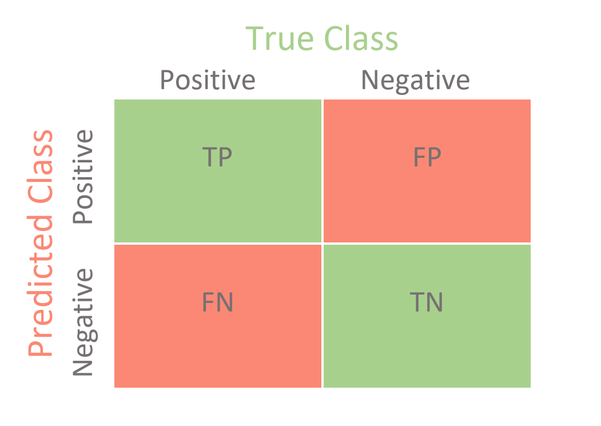

-   [Introduction et contexte](#introduction-et-contexte)
-   [Matériels et méthodes](#matériels-et-méthodes)
    -   [Outils technologiques](#outils-technologiques)
-   [Les données](#les-données)
    -   [Importation](#importation)
    -   [Structure du DataFrame](#structure-du-dataframe)
-   [Description des variables](#description-des-variables)
    -   [Données sociales](#données-sociales)
    -   [Données bancaires](#données-bancaires)
    -   [Variable target](#variable-target)
-   [Librairies](#librairies)
-   [Nettoyage des données](#nettoyage-des-données)
    -   [Suppression des variables
        inutiles](#suppression-des-variables-inutiles)
    -   [Valeurs nulles](#valeurs-nulles)
    -   [Valeurs “inconnues”](#valeurs-inconnues)
    -   [Convertion des variables
        d’apprentissage](#convertion-des-variables-dapprentissage)
    -   [Variable Customer\_Age](#variable-customer_age)
-   [Analyse exploratoire des
    données](#analyse-exploratoire-des-données)
    -   [Statistiques descriptives
        univariées](#statistiques-descriptives-univariées)
    -   [Statistiques descriptives
        bivariées](#statistiques-descriptives-bivariées)
-   [Plan d’analyse](#plan-danalyse)
-   [Prédire la fidélité d’un client déjà
    existant](#prédire-la-fidélité-dun-client-déjà-existant)
    -   [Stratégie de classification](#stratégie-de-classification)
    -   [Modèle complet](#modèle-complet)
    -   [Significativité des
        coefficients](#significativité-des-coefficients)
    -   [Sélection des variables](#sélection-des-variables)
    -   [Evaluation de la régression logistique sur le modèle
        ajusté](#evaluation-de-la-régression-logistique-sur-le-modèle-ajusté)
    -   [Effet des variables
        (Odds-ratios)](#effet-des-variables-odds-ratios)
    -   [Profil d’un client non fidèle](#profil-dun-client-non-fidèle)
    -   [Profil d’un client fidèle](#profil-dun-client-fidèle)
-   [Prédire la fidélité d’un nouveau
    client](#prédire-la-fidélité-dun-nouveau-client)
    -   [Modèle complet](#modèle-complet-1)
    -   [Significativité des
        coefficients](#significativité-des-coefficients-1)
    -   [Sélection des variables](#sélection-des-variables-1)
    -   [Evaluation de la régression logistique sur le modèle
        ajusté](#evaluation-de-la-régression-logistique-sur-le-modèle-ajusté-1)
    -   [Effet des variables
        (Odds-ratios)](#effet-des-variables-odds-ratios-1)
    -   [Profil d’un client non fidèle](#profil-dun-client-non-fidèle-1)
    -   [Profil d’un client fidèle](#profil-dun-client-fidèle-1)
    -   [Exemple de prédiction d’un nouveau
        client](#exemple-de-prédiction-dun-nouveau-client)
-   [Analyse de survie](#analyse-de-survie)
    -   [Objectifs](#objectifs)
    -   [Préparation des données](#préparation-des-données)
    -   [Estimation de la survie](#estimation-de-la-survie)
    -   [Courbe de survie globale](#courbe-de-survie-globale)
    -   [Influence de la variable
        Gender](#influence-de-la-variable-gender)
    -   [Influence de la variable
        Customer\_Age](#influence-de-la-variable-customer_age)
    -   [Influence de la variable
        Education\_Level](#influence-de-la-variable-education_level)
    -   [Influence de la variable
        Marital\_Status](#influence-de-la-variable-marital_status)
    -   [Influence de la variable
        Income\_Category](#influence-de-la-variable-income_category)
    -   [Influence de la variable
        Card\_Category](#influence-de-la-variable-card_category)
    -   [Modèle de Cox](#modèle-de-cox)
-   [Conclusion](#conclusion)

Mots clés : *banque*, *relation client*, *fidélisation*, *statistique*,
*machine learning*, *classification supervisée*, *régression
logistique*, *validation croisée*, *odds-ratios*, *analyse de survie*

Technologie : [R](https://rstudio.com/)

------------------------------------------------------------------------

# Introduction et contexte

Le fonctionnement d’une banque peut se rapprocher à celle d’une
entreprise. Aujourd’hui, la principale difficulté d’une banque est
d’attirer un maximum de client mais également de les conserver sur le
long terme. Le client est donc un élément clé pour toute organisation
et, par conséquent, chaque entité s’efforce de fidéliser ses clients.
Les statistiques et l’intelligence artificielle peuvent aider les
banques à réduire le risque d’attrition des clients (désabonnement de la
clientèle). Pour cela, une banque a besoin de comprendre ce qui
distingue un client fidèle d’un non fidèle.

Les données disponibles concernent des informations sur les clients
d’une banque (âge, revenu, crédit accordé, nombre de transactions, etc).
En effet, les banques souhaitent comprendre les raisons de départ des
titulaires de compte afin d’améliorer la qualité de service et le
parcours client. Le jeu de données provient du site
[Leaps](https://leaps.analyttica.com/sample_cases/11).

L’objectif de cette étude est de **définir le profil d’un client
fidèle** selon différentes caractéristiques. Pour cela, nous allons nous
appuyer sur des variables **sociales** (âge, sexe, niveau d’étude,
revenu, état civil, etc) et **bancaires** (catégorie de la carte, limite
de crédit, etc). Le but est d’anticiper si un client va quitter la
banque afin d’être capable de proposer les meilleurs services pour le
fidéliser.

L’idée générale est de comparer et de comprendre le profil d’un client
fidèle et d’un client qui a quitté la banque à l’aide de la variable
*Attrition\_Flag* (Existing Customer = le client reste dans la banque,
Attrited Customer = le client quitte la banque).

Cette étude statistique va nous servir à répondre à ces problématiques :

-   Quel est le profil d’un client fidèle ?
-   Quelles sont les différences entre un client fidèle et un client qui
    a quitté la banque ?
-   Quels attributs (caractéristiques) poussent nos clients à quitter
    l’organisation ?
-   Quels sont les attributs qui distinguent les deux groupes de clients
    ?
-   Comment fidéliser les clients ?

# Matériels et méthodes

Dans ce problème, nous avons quatres tâches principales à effectuer afin
de proposer des solutions et des conclusions pertinantes :

-   Nettoyer des données
-   Explorer les données
-   Implémenter un algorithme de classification
-   Analyse de survie

Pour cela, les connaissances acquises lors de mon DUT Statistique et
Informatique Décisionnelle et en licence 3 SID m’ont permises de mener à
bien ce projet.

D’une part, j’ai appliqué des méthodes statistiques comme le test de
Student et de Fisher du module **Statistique Inférentielle**, ainsi que
le test d’indépendance du khi-deux vu en **Statistique exploratoire** au
premier semestre de L3.

D’autre part, j’ai été amené à utiliser l’Unité d’Enseignement
**Introduction au Machine Learning** pour la classification en
régression logistique. Je me suis égalaement servi de mes cours de
**Data Mining** de DUT pour évaluer la qualité d’une classification
(validation croisée, k plis).

La partie dont je n’avais pas de connaissances est l’**analyse des
données de survie**. J’ai donc eu une première approche grâce à des
cours de M2 SID et à plusieurs ressources web.

## Outils technologiques

-   **RStudio** : c’est un environnement de développement pour le
    langage R. Ce logiciel s’avère également utile dans la rédaction du
    rapport puisqu’il offre la possibilité de créer des sorties Word en
    intégrant le code R. Le fichier R Notebook a été utilisé pour
    l’éxécution du code, la réalisation des graphiques et la mise forme
    de résultats.

-   **Word** : le pack office m’a été utile pour la rédaction du rapport
    et la mise en forme.

# Les données

Le jeu de données est accessible depuis la plateforme
[Kaggle](https://www.kaggle.com/sakshigoyal7/credit-card-customers).

## Importation

    c <- getwd() # répertoire local
    setwd(c)
    df <- read.csv2("BankChurners.csv", header = T, sep = ",", dec = ".") # chargement du jeu de données

## Structure du DataFrame

Le DataFrame contient dim(df)\[1\] comptes de cartes de crédit avec
dim(df)\[2\] attributs.

1 ligne correspond à 1 client ou ex-client de la banque.

# Description des variables

Je décris les attributs pour une meilleure compréhension des données.

## Données sociales

-   *Customer\_Age* : âge du client
-   *Gender* : sexe du client

<!-- -->

    ## [1] "M" "F"

-   *Dependent\_count* : nombre d’enfants à charge
-   *Education\_Level* : niveau d’éducation du titulaire du compte

<!-- -->

    ## [1] "High School"   "Graduate"      "Uneducated"    "Unknown"      
    ## [5] "College"       "Post-Graduate" "Doctorate"

-   *Marital\_Status* : état civil du client

<!-- -->

    ## [1] "Married"  "Single"   "Unknown"  "Divorced"

-   *Income\_Category* : revenu annuel du client en dollars

<!-- -->

    ## [1] "$60K - $80K"    "Less than $40K" "$80K - $120K"   "$40K - $60K"   
    ## [5] "$120K +"        "Unknown"

## Données bancaires

-   *Card\_Category* : type de carte

<!-- -->

    ## [1] "Blue"     "Gold"     "Silver"   "Platinum"

-   *Months\_on\_book* : durée de la relation avec la banque en mois
-   *Total\_Relationship\_Count* : nombre total des produits détenus par
    le client (cartes, comptes, etc)
-   *Months\_Inactive\_12\_mon* : durée d’inactivité d’utilisation de la
    carte de crédit
-   *Contacts\_Count\_12\_mon* : nombre de contact entre la banque et le
    client (emails, rendez-vous, etc) sur les 12 derniers mois
-   *Credit\_Limit* : limite de crédit dont dispose actuellement le
    client
-   *Total\_Revolving\_Bal* : la partie impayée qui est reportée au mois
    suivant lorsqu’un client ne paie pas
-   *Avg\_Utilization\_Ratio* : mesure le crédit utilisé par rapport au
    montant
-   *Total\_Trans\_Amt* : somme des transactions opérées par le client
-   *Total\_Trans\_Ct* : nombre de transactions
-   *Total\_Amt\_Chng\_Q4\_Q1* : représente de combien le client a
    augmenté ses dépenses en comparant le 4ème trimestre au 1er
-   *Total\_Ct\_Chng\_Q4\_Q1* : similaire au précédent mais en nombre de
    transactions

## Variable target

La variable à prédire (target) est *Attrition\_Flag*, elle désigne si le
client a quitté la banque ou non. Donc elle témoigne de la fidélité du
client.

Je recode la variable catégorielle en **2 classes** avec **as.factor** :

    sum(is.na(df$Attrition_Flag)) # nombre de valeurs nulles

    ## [1] 0

    df$Attrition_Flag = as.factor(df$Attrition_Flag) # convertion en type facteur

*Attrition\_Flag* n’a pas de valeurs manquantes.

Il n’est pas forcément nécessaire de transformer la variable d’intérêt
en variable booléenne (0 ou 1) car R accepte sans problème une variable
de type facteur.

# Librairies

Voici les bibliothèques utilisées et comment elles nous aideront à
résoudre ce problème.

Chargement des packages :

    library(Hmisc) # fournit des fonctions pour l'analyse des données
    library(car) # fournit des fonctions d'Anova
    library(dplyr) # fournit des fonctions pour la manipulation de données
    library(forcats) # fournit des fonctions de gestion simplifiée des variables de type facteur
    library(ggplot2) # fournit des fonctions de graphiques avancés
    library(ggridges) # fournit des fonctions de graphiques avancés
    library(corrplot) # graphique des corrélations
    library(caret) # fournit des fonctions de classification et régression
    library(MLmetrics) # fournit des mesures d'évaluation pour la classification
    library(questionr) # calculer les odds-ratios d'une régression logistique
    library(vip) # tracer les scores d'importance des variables
    library(ROCR) # tracer la courbe ROC et d'obtenir la valeur AUC
    library(GGally) # graphique pour la régression logistique (odds-ratios)
    library(broom.helpers) # fonctions pour la régression
    library(survival) # fonctions pour l'analyse de survie
    library(splines)
    library(survminer) # jolies courbes de survie

# Nettoyage des données

## Suppression des variables inutiles

    ##  [1] "CLIENTNUM"                                                                                                                         
    ##  [2] "Attrition_Flag"                                                                                                                    
    ##  [3] "Customer_Age"                                                                                                                      
    ##  [4] "Gender"                                                                                                                            
    ##  [5] "Dependent_count"                                                                                                                   
    ##  [6] "Education_Level"                                                                                                                   
    ##  [7] "Marital_Status"                                                                                                                    
    ##  [8] "Income_Category"                                                                                                                   
    ##  [9] "Card_Category"                                                                                                                     
    ## [10] "Months_on_book"                                                                                                                    
    ## [11] "Total_Relationship_Count"                                                                                                          
    ## [12] "Months_Inactive_12_mon"                                                                                                            
    ## [13] "Contacts_Count_12_mon"                                                                                                             
    ## [14] "Credit_Limit"                                                                                                                      
    ## [15] "Total_Revolving_Bal"                                                                                                               
    ## [16] "Avg_Open_To_Buy"                                                                                                                   
    ## [17] "Total_Amt_Chng_Q4_Q1"                                                                                                              
    ## [18] "Total_Trans_Amt"                                                                                                                   
    ## [19] "Total_Trans_Ct"                                                                                                                    
    ## [20] "Total_Ct_Chng_Q4_Q1"                                                                                                               
    ## [21] "Avg_Utilization_Ratio"                                                                                                             
    ## [22] "Naive_Bayes_Classifier_Attrition_Flag_Card_Category_Contacts_Count_12_mon_Dependent_count_Education_Level_Months_Inactive_12_mon_1"
    ## [23] "Naive_Bayes_Classifier_Attrition_Flag_Card_Category_Contacts_Count_12_mon_Dependent_count_Education_Level_Months_Inactive_12_mon_2"

Je supprime les variables non pertinentes :

-   *CLIENTNUM*
-   *Naive\_Bayes\_Classifier\_Attrition\_Flag\_Card\_Category\_Contacts\_Count\_12\_mon\_Dependent\_count\_Education\_Level\_Months\_Inactive\_12\_mon\_1*
-   *Naive\_Bayes\_Classifier\_Attrition\_Flag\_Card\_Category\_Contacts\_Count\_12\_mon\_Dependent\_count\_Education\_Level\_Months\_Inactive\_12\_mon\_2*

<!-- -->

    df <- df[, -c(1,22,23)]

## Valeurs nulles

    ##           Attrition_Flag             Customer_Age                   Gender 
    ##                        0                        0                        0 
    ##          Dependent_count          Education_Level           Marital_Status 
    ##                        0                        0                        0 
    ##          Income_Category            Card_Category           Months_on_book 
    ##                        0                        0                        0 
    ## Total_Relationship_Count   Months_Inactive_12_mon    Contacts_Count_12_mon 
    ##                        0                        0                        0 
    ##             Credit_Limit      Total_Revolving_Bal          Avg_Open_To_Buy 
    ##                        0                        0                        0 
    ##     Total_Amt_Chng_Q4_Q1          Total_Trans_Amt           Total_Trans_Ct 
    ##                        0                        0                        0 
    ##      Total_Ct_Chng_Q4_Q1    Avg_Utilization_Ratio 
    ##                        0                        0

Le jeu de données ne contient pas de valeurs nulles ce qui facilite la
correction des données et l’analyse.

## Valeurs “inconnues”

Des variables qualitatives ont des modalités **“Unknown”**. On supprime
toutes les lignes inconnues de *Education\_Level*, *Marital\_Status* et
*Income\_Category* avec la librairie **dplyr**.

    df <- dplyr::filter(df, Education_Level != "Unknown", Marital_Status != "Unknown", Income_Category != "Unknown") # je supprime les lignes inconnues avec dplyr

Le nouveau DataFrame a 7081 lignes/clients.

## Convertion des variables d’apprentissage

    ## 'data.frame':    7081 obs. of  20 variables:
    ##  $ Attrition_Flag          : Factor w/ 2 levels "Attrited Customer",..: 2 2 2 2 2 2 2 2 2 2 ...
    ##  $ Customer_Age            : int  45 49 51 40 44 37 48 56 57 48 ...
    ##  $ Gender                  : chr  "M" "F" "M" "M" ...
    ##  $ Dependent_count         : int  3 5 3 3 2 3 2 1 2 4 ...
    ##  $ Education_Level         : chr  "High School" "Graduate" "Graduate" "Uneducated" ...
    ##  $ Marital_Status          : chr  "Married" "Single" "Married" "Married" ...
    ##  $ Income_Category         : chr  "$60K - $80K" "Less than $40K" "$80K - $120K" "$60K - $80K" ...
    ##  $ Card_Category           : chr  "Blue" "Blue" "Blue" "Blue" ...
    ##  $ Months_on_book          : int  39 44 36 21 36 36 36 36 48 36 ...
    ##  $ Total_Relationship_Count: int  5 6 4 5 3 5 6 3 5 6 ...
    ##  $ Months_Inactive_12_mon  : int  1 1 1 1 1 2 3 6 2 2 ...
    ##  $ Contacts_Count_12_mon   : int  3 2 0 0 2 0 3 0 2 3 ...
    ##  $ Credit_Limit            : num  12691 8256 3418 4716 4010 ...
    ##  $ Total_Revolving_Bal     : int  777 864 0 0 1247 2517 1677 0 680 2362 ...
    ##  $ Avg_Open_To_Buy         : num  11914 7392 3418 4716 2763 ...
    ##  $ Total_Amt_Chng_Q4_Q1    : num  1.33 1.54 2.59 2.17 1.38 ...
    ##  $ Total_Trans_Amt         : int  1144 1291 1887 816 1088 1350 1441 1539 1570 1671 ...
    ##  $ Total_Trans_Ct          : int  42 33 20 28 24 24 32 17 29 27 ...
    ##  $ Total_Ct_Chng_Q4_Q1     : num  1.625 3.714 2.333 2.5 0.846 ...
    ##  $ Avg_Utilization_Ratio   : num  0.061 0.105 0 0 0.311 0.113 0.144 0 0.279 0.078 ...

Certaines variables (variables catégorielles) sont codées dans un
mauvais format pour les fonctions de classification. Par exemple,
l’attribut *Gender* doit être convertit en type facteur.

Nous allons donc commencer par les convertir en type facteur à l’aide de
la fonction **as.factor**.

    df$Gender <- as.factor(df$Gender)
    df$Education_Level <- as.factor(df$Education_Level)
    df$Marital_Status <- as.factor(df$Marital_Status)
    df$Income_Category <- as.factor(df$Income_Category)
    df$Card_Category <- as.factor(df$Card_Category)

La convertion des variables qualitatives en facteurs permet de définir
des niveaux/modalités.

    ## [1] 2

    ## [1] "F" "M"

Pour la variable *Gender*, on distingue 2 niveaux :

-   F = femme
-   M = homme

<!-- -->

    ## [1] 6

    ## [1] "College"       "Doctorate"     "Graduate"      "High School"  
    ## [5] "Post-Graduate" "Uneducated"

La variable *Education\_Level* est une variable qualitative ordinale.

    df$Education_Level <- fct_relevel(df$Education_Level, "Uneducated", "High School", "College",
      "Doctorate", "Post-Graduate", "Graduate") # ordonner les modalités d’une variable qualitative

Pour la variable *Education\_Level*, on distingue 6 niveaux :

-   Uneducated
-   High School
-   College
-   Doctorate
-   Graduate
-   Post-Graduate

<!-- -->

    ## [1] 3

    ## [1] "Divorced" "Married"  "Single"

Pour la variable *Marital\_Status*, on distingue 3 niveaux :

-   Divorced
-   Married
-   Single

<!-- -->

    ## [1] 5

    ## [1] "$120K +"        "$40K - $60K"    "$60K - $80K"    "$80K - $120K"  
    ## [5] "Less than $40K"

La variable *Income\_Category* est une variable qualitative ordinale. Je
trie les modalités du plus bas salaire au plus haut.

    df$Income_Category <- fct_relevel(df$Income_Category, "Less than $40K", "$40K - $60K", "$60K - $80K",
      "$80K - $120K", "$120K +") # ordonner les modalités d’une variable qualitative

Pour la variable *Income\_Category*, on distingue 5 niveaux :

-   Less than 40K
-   40K - 60K
-   60K - 80K
-   80K - 120K
-   120K +

<!-- -->

    ## [1] 4

    ## [1] "Blue"     "Gold"     "Platinum" "Silver"

La variable *Card\_Category* est une variable qualitative ordinale.

    df$Card_Category <- fct_relevel(df$Card_Category, "Blue", "Silver", "Platinum",
      "Gold") # ordonner les modalités d’une variable qualitative

Pour la variable *Card\_Category*, on distingue 4 niveaux :

-   Blue
-   Silver
-   Platinum
-   Gold

## Variable Customer\_Age

    ##  int [1:7081] 45 49 51 40 44 37 48 56 57 48 ...

La variable âge est bien codée sous format entier mais il est utile de
transformer la variable **Customer\_Age** en variable catégorielle à
l’aide de la fonction **cut**.

La répartition des âges semblent suivre une loi normale. Je choisis de
découper la variable numérique en 4 classes.

    df$Customer_Age <- cut(df$Customer_Age, breaks = 4, labels = c("26yo-37yo", "38yo-49yo", "50yo-61yo", "62yo-73yo"), include.lowest = TRUE)
    levels(df$Customer_Age)

    ## [1] "26yo-37yo" "38yo-49yo" "50yo-61yo" "62yo-73yo"

-   Nombre de variables quantitatives : **12**
-   Nombre de variables qualitatives : **8**

Ce type de convertion nous permettra d’utliser des algorithmes de
classification.

# Analyse exploratoire des données

Le but de cette première approche statistique est de comparer deux
groupes avec la variable binaire *Attrition\_Flag* qui a deux classes
(client fidèle et non fidèle). Nous allons voir si l’on distingue des
différences.

## Statistiques descriptives univariées

**Attrition\_Flag**

    ## [7081 obs.] 
    ## nominal factor: "Existing Customer" "Existing Customer" "Existing Customer" "Existing Customer" "Existing Customer" "Existing Customer" "Existing Customer" "Existing Customer" "Existing Customer" "Existing Customer" ...
    ## 2 levels: Attrited Customer | Existing Customer
    ## NAs: 0 (0%)
    ## 
    ##                      n     %
    ## Attrited Customer 1113  15.7
    ## Existing Customer 5968  84.3
    ## Total             7081 100.0

Le jeu de données est **déséquilibré** car **84%** des clients sont
toujours dans la banque contre **16%** de désabonnement.

**Customer\_Age**

    ## [7081 obs.] 
    ## nominal factor: "38yo-49yo" "38yo-49yo" "50yo-61yo" "38yo-49yo" "38yo-49yo" "26yo-37yo" "38yo-49yo" "50yo-61yo" "50yo-61yo" "38yo-49yo" ...
    ## 4 levels: 26yo-37yo | 38yo-49yo | 50yo-61yo | 62yo-73yo
    ## NAs: 0 (0%)
    ## 
    ##              n     %
    ## 26yo-37yo 1001  14.1
    ## 38yo-49yo 3552  50.2
    ## 50yo-61yo 2322  32.8
    ## 62yo-73yo  206   2.9
    ## Total     7081 100.0

La classe d’âge la plus représentée est 38-49ans avec 50% des clients.
La deuxième classe est les personnes de 50 à 61ans. Au final, la
majorité des clients ont entre 38ans et 61 ans, ce qui concerne la part
active de la population.

Seulement 3% des clients ont entre se situent entre 62 et 73 ans.

**Gender**

    ## 
    ##    F    M 
    ## 0.48 0.52

La répartition de la variable *Gender* est équitable. Il y autant de
femmes (48%) que d’hommes (52%).

**Dependent\_count**

    ##    Min. 1st Qu.  Median    Mean 3rd Qu.    Max. 
    ##   0.000   1.000   2.000   2.338   3.000   5.000

On remarque une répartition en forme de cloche, le nombre de personnes à
charges peut se rapporcher d’une loi Normale.

En moyenne, les clients ont 2.3 enfants. On peut supposer que les
clients avec des enfants un est un facteur d’augmentation des dépenses.
Pour affiner ce résultat, il serait judicieux de comparer le nombre de
personnes à charge entre un client fidèle et un client qui a quitté la
banque lors de l’analyse bivariée.

**Education\_Level**

    ## [7081 obs.] 
    ## nominal factor: "High School" "Graduate" "Graduate" "Uneducated" "Graduate" "Uneducated" "Graduate" "College" "Graduate" "Post-Graduate" ...
    ## 6 levels: Uneducated | High School | College | Doctorate | Post-Graduate | Graduate
    ## NAs: 0 (0%)
    ## 
    ##                  n     %
    ## Uneducated    1204  17.0
    ## High School   1653  23.3
    ## College        844  11.9
    ## Doctorate      358   5.1
    ## Post-Graduate  431   6.1
    ## Graduate      2591  36.6
    ## Total         7081 100.0

Le jeu de données montre que 37% des clients sont diplomés.

**Income\_Category**

    ## 
    ## Less than $40K    $40K - $60K    $60K - $80K   $80K - $120K        $120K + 
    ##          39.43          19.94          15.58          16.98           8.08

40% des clients actuels/sortis gagnent moins de 40K dollars annuel.

**Months\_on\_book**

    ##    Min. 1st Qu.  Median    Mean 3rd Qu.    Max. 
    ##   13.00   31.00   36.00   35.98   40.00   56.00

La durée moyenne de la relation entre le client et la banque est de 36
mois (soit environ 3 ans).

De plus, 50% des relations client/banque durent entre 31 (1er quartile)
et 40 mois (3ème quartile).

**Credit\_Limit**

    ##    Min. 1st Qu.  Median    Mean 3rd Qu.    Max. 
    ##    1438    2498    4287    8493   10729   34516

La limite de crédit moyenne est de 8632 dollars, tandis que la médiane
est de 4549 dollars, ce qui pourrait indiquer qu’il existe des très
grande valeurs dans notre ensemble de données en raison de cet écart
entre la moyenne et la médiane.

## Statistiques descriptives bivariées

**Gender selon Attrition\_Flag**

    ##      
    ##       Attrited Customer Existing Customer  Sum
    ##   F                 576              2799 3375
    ##   M                 537              3169 3706
    ##   Sum              1113              5968 7081

    ##    
    ##     Attrited Customer Existing Customer
    ##   F                17                83
    ##   M                14                86

    ##    
    ##     Attrited Customer Existing Customer
    ##   F                52                47
    ##   M                48                53

On remarque une différence de fidélité entre un client homme et femme.
Les hommes semblent rester plus longtemps dans la banque car 52% des
ex-clients sont des femmes.

Pour vérifier cette hypothèse, je réalise un **test d’indépendance du
khi-deux**

*Le test du Chi-deux permet de détecter s’il existe une différence de
répartition entre les modalités d’une variable selon les modalités d’une
autre variable.*

**Hypothèses** :

-   H0 : pas de différence entre les modalités de *Gender* et la
    fidélité
-   H1 : il existe une différence entre les modalités de *Gender* et la
    fidélité

La taille de l’échantillon est supérieur à 5.

    p_valeur <- round(chisq.test(df$Attrition_Flag, df$Gender)$p.value, 3) # p-valeur du test du khi-deux

Ici, on obtient une p-valeur de 0.003, inférieure à 0.05 donc on peut
rejetter H0 (indépendance) au profit de H1, il existe une différence
significative de fidélité entre les hommes et les femmes.

**Income\_Category selon Attrition\_Flag**

    ##                 
    ##                  Attrited Customer Existing Customer  Sum
    ##   Less than $40K               473              2319 2792
    ##   $40K - $60K                  204              1208 1412
    ##   $60K - $80K                  145               958 1103
    ##   $80K - $120K                 189              1013 1202
    ##   $120K +                      102               470  572
    ##   Sum                         1113              5968 7081

    ##                 
    ##                  Attrited Customer Existing Customer
    ##   Less than $40K             16.94             83.06
    ##   $40K - $60K                14.45             85.55
    ##   $60K - $80K                13.15             86.85
    ##   $80K - $120K               15.72             84.28
    ##   $120K +                    17.83             82.17

    ##                 
    ##                  Attrited Customer Existing Customer
    ##   Less than $40K             42.50             38.86
    ##   $40K - $60K                18.33             20.24
    ##   $60K - $80K                13.03             16.05
    ##   $80K - $120K               16.98             16.97
    ##   $120K +                     9.16              7.88

Une majorité de clients partis appartiennent à la catégorie de revenu
inférieure à 40 000 dollars. Cependant, on sait que cette classe
concerne 40% des observations.

Je vais chercher à savoir s’il existe une différence de fidélité entre
les revenus.

J’utilise le **test d’indépendance du khi-deux** avec la fonction
**chisq.test**.

**Hypothèses** :

-   H0 : pas de différence entre les modalités de *Income\_Category* et
    la fidélité
-   H1 : il existe une différence entre les modalités de
    *Income\_Category* et la fidélité

On obtient une p-valeur de 0.015, inférieure à 0.05 donc on rejette H0
(indépendance) au profit de H1, il y a une différence de fidélité entre
les revenus. Cette variable est discriminante.

**Education\_Level selon Attrition\_Flag**

    ##                
    ##                 Attrited Customer Existing Customer  Sum
    ##   Uneducated                  186              1018 1204
    ##   High School                 237              1416 1653
    ##   College                     132               712  844
    ##   Doctorate                    75               283  358
    ##   Post-Graduate                77               354  431
    ##   Graduate                    406              2185 2591
    ##   Sum                        1113              5968 7081

    ##                
    ##                 Attrited Customer Existing Customer
    ##   Uneducated                   15                85
    ##   High School                  14                86
    ##   College                      16                84
    ##   Doctorate                    21                79
    ##   Post-Graduate                18                82
    ##   Graduate                     16                84

    ##                
    ##                 Attrited Customer Existing Customer
    ##   Uneducated                   17                17
    ##   High School                  21                24
    ##   College                      12                12
    ##   Doctorate                     7                 5
    ##   Post-Graduate                 7                 6
    ##   Graduate                     36                37

Avec le tableau 1, on voit que la part des doctorants partis de la
banque est plus élevée que les autres diplômes.

*Existe-t-il un lien statistique entre le niveau d’éducation et la
fidélité ?*

**Test d’indépendance du khi-deux**

**Hypothèses** :

-   H0 : pas de différence entre les modalités de *Education\_Level* et
    la fidélité
-   H1 : il existe une différence entre les modalités de
    *Education\_Level* et la fidélité

Avec la p-valeur du test (0.045), on remarque qu’il y a une différence
entre la fidélité et le niveau d’éducation. La fidélité dépend en partie
du niveau de formation du client.

**Marital\_Status selon Attrition\_Flag**

    ##           
    ##            Attrited Customer Existing Customer  Sum
    ##   Divorced                92               477  569
    ##   Married                529              3035 3564
    ##   Single                 492              2456 2948
    ##   Sum                   1113              5968 7081

    ##           
    ##            Attrited Customer Existing Customer
    ##   Divorced                16                84
    ##   Married                 15                85
    ##   Single                  17                83

    ##           
    ##            Attrited Customer Existing Customer
    ##   Divorced                 8                 8
    ##   Married                 48                51
    ##   Single                  44                41

Une très faible proportion des clients sont divorcés, la majorité sont
mariés ou célibataires.

**Customer\_Age selon Attrition\_Flag**

    ##            
    ##             Attrited Customer Existing Customer  Sum
    ##   26yo-37yo               129               872 1001
    ##   38yo-49yo               592              2960 3552
    ##   50yo-61yo               366              1956 2322
    ##   62yo-73yo                26               180  206
    ##   Sum                    1113              5968 7081

    ##            
    ##             Attrited Customer Existing Customer
    ##   26yo-37yo                13                87
    ##   38yo-49yo                17                83
    ##   50yo-61yo                16                84
    ##   62yo-73yo                13                87

    ##            
    ##             Attrited Customer Existing Customer
    ##   26yo-37yo                12                15
    ##   38yo-49yo                53                50
    ##   50yo-61yo                33                33
    ##   62yo-73yo                 2                 3

On observe que les clients entre 38 et 61 ans quittent plus souvent la
banque.

Le **test du khi-deux** montre qu’il y a une différence significative
entre les groupes d’âges et la fidélité (p-valeur = 0.019). Cette
variable semble avoir un effet sur la fidélité.

**Card\_Category selon Attrition\_Flag**

    ##           
    ##            Attrited Customer Existing Customer  Sum
    ##   Blue                  1034              5564 6598
    ##   Silver                  63               328  391
    ##   Platinum                 3                 8   11
    ##   Gold                    13                68   81
    ##   Sum                   1113              5968 7081

    ##           
    ##            Attrited Customer Existing Customer
    ##   Blue                    16                84
    ##   Silver                  16                84
    ##   Platinum                27                73
    ##   Gold                    16                84

    ##           
    ##            Attrited Customer Existing Customer
    ##   Blue                    93                93
    ##   Silver                   6                 5
    ##   Platinum                 0                 0
    ##   Gold                     1                 1

La plupart des clients ont une carte bleue.

Le **test du khi-deux** montre qu’il n’y a pas de différence
significative entre la fidélité et le type de carte (p-valeur = 0.76).

**Credit\_Limit selon Attrition\_Flag**

    ## Attrited Customer Existing Customer 
    ##          8158.580          8555.099

    ## Attrited Customer Existing Customer 
    ##          9174.078          9116.508

Ci-dessus, nous pouvons évidemment voir que les clients qui quittent une
banque ont des limites de crédit inférieures aux clients les plus
fidèles. Cependant, les variances sont sensiblement égales.

*Est-ce que les clients non fidèles ont une limite de crédit inférieure
aux clients fidèle ?*

Pour répondre à cette question, j’utilise un **test de comparaison
unilatéral gauche de moyenne pour 2 échantillons non appariés**.

Je commence par construire deux groupes (client fidèle et client non
fidèle) avec la fonction **which**.

    Attrited <- which(df$Attrition_Flag == "Attrited Customer") # indices (n° lignes) Attrited Customer
    Attrited <- df$Credit_Limit[Attrited]  # extraction des Credit_Limit associés
    Existing <- which(df$Attrition_Flag == "Existing Customer") # indices (n° lignes) Existing Customer
    Existing <- df$Credit_Limit[Existing]  # extraction des Credit_Limit associés

L’échantillon est suffisamment grand pour ignorer la normalité des
données.

Je vérifie l’égalité des variances avec le **test de Fisher** et la
fonction **var.test**.

**Hypothèses** :

-   H0 : les variances sont égales
-   H1 : les variances sont différentes

<!-- -->

    p_valeur <- round(var.test(Attrited, Existing)$p.value, 3)

La p-valeur (0.777) est très supérieure à 0.05 donc on conserve H0. Les
variances sont égales donc je peux appliquer le **test de Student**.

**Hypothèses** :

-   H0 : les moyennes empiriques de Credit\_Limit des Attrited et
    Existing sont égales
-   H1 : la moyenne empirique de Credit\_Limit des Attrited est
    inférieure

<!-- -->

    t.test(Attrited, Existing, alternative = "less", var.equal = TRUE)$p.value

    ## [1] 0.09164588

On conserve H0, les moyennes de *Credit\_Limit* sont égales entre un
client fidèle et non fidèle. La limite de crédit autorisée n’influe pas
sur le départ du client.

**Months\_on\_book selon Attrition\_Flag**

    ## Attrited Customer Existing Customer 
    ##             36.15             35.95

    ## Attrited Customer Existing Customer 
    ##              7.91              8.02

Ci-dessus, nous pouvons évidemment voir que les clients qui quittent une
banque ont des durées de relation inférieures aux clients les plus
fidèles.

*Existe-t-il une différence significative de la durée de la relation
entre un client fidèle et non fidèle ?*

**Test de comparaison bilatéral de moyenne pour 2 échantillons non
appariés**

    var.test(Attrited, Existing)$p.value

    ## [1] 0.5470327

Les variances sont égales donc je peux appliquer le **test de Student**.

    t.test(Attrited, Existing, var.equal = TRUE)$p.value

    ## [1] 0.4364663

Les durées des relations sont égales entre un client fidèle et non
fidèle.

**Months\_Inactive\_12\_mon selon Attrition\_Flag**

    ## Attrited Customer Existing Customer 
    ##              2.69              2.28

    ## Attrited Customer Existing Customer 
    ##              0.88              1.00

*Est-ce que la durée d’inactivité est supérieure chez les clients non
fidèles ?*

**Test de comparaison unilatéral gauche de moyenne pour 2 échantillons
non appariés**

    var.test(Attrited, Existing)$p.value

    ## [1] 4.886998e-08

La p-valeur est inférieure à 0.05 donc on rejette H0 au profit de H1. Le
variances ne sont pas égales.

    t.test(Attrited, Existing, alternative = "greater", var.equal = FALSE)$p.value

    ## [1] 1.068151e-43

Un client qui quitte la banque est beaucoup moins actif qu’un client qui
reste.

**Total\_Trans\_Amt selon Attrition\_Flag**

*Est-ce que le montant des transactions est inférieure chez les clients
non fidèles ?*

**Test de comparaison unilatéral droit de moyenne pour 2 échantillons
non appariés**

    var.test(Attrited, Existing)$p.value

    ## [1] 9.195257e-61

La p-valeur est inférieure à 0.05 donc on rejette H0 au profit de H1. Le
variances ne sont pas égales.

    t.test(Attrited, Existing, alternative = "less", var.equal = FALSE)$p.value

    ## [1] 2.092979e-68

La p-valeur est largement inférieure à 0.05 donc un client infidèle
réalise moins de dépense.

**Est-ce que le crédit accordé dépend du revenu ?**

    ## Less than $40K    $40K - $60K    $60K - $80K   $80K - $120K        $120K + 
    ##       3746.352       5333.873      10685.174      15956.169      19547.250

    ## Less than $40K    $40K - $60K    $60K - $80K   $80K - $120K        $120K + 
    ##       2753.095       4414.974       8789.735      11255.586      12169.595

Une catégorie de revenu plus élevée est corrélée à une limite de crédit
plus élevée.

Pour chaque revenu, on distingue une différence de crédit entre un
client existant et parti. Un client qui reste dans la banque a tendance
à avoir plus de crédit.

Le type de carte donne des différences sur la limite de crédit. Détenir
une carte bleue donne accès à un crédit limité.

**Corrélation**

    ##                        Months_Inactive_12_mon Credit_Limit Total_Revolving_Bal
    ## Months_Inactive_12_mon                  1.000       -0.016              -0.040
    ## Credit_Limit                           -0.016        1.000               0.038
    ## Total_Revolving_Bal                    -0.040        0.038               1.000
    ## Avg_Open_To_Buy                        -0.012        0.996              -0.051
    ## Total_Amt_Chng_Q4_Q1                   -0.028        0.002               0.062
    ## Total_Ct_Chng_Q4_Q1                    -0.040       -0.006               0.084
    ##                        Avg_Open_To_Buy Total_Amt_Chng_Q4_Q1 Total_Ct_Chng_Q4_Q1
    ## Months_Inactive_12_mon          -0.012               -0.028              -0.040
    ## Credit_Limit                     0.996                0.002              -0.006
    ## Total_Revolving_Bal             -0.051                0.062               0.084
    ## Avg_Open_To_Buy                  1.000               -0.004              -0.013
    ## Total_Amt_Chng_Q4_Q1            -0.004                1.000               0.390
    ## Total_Ct_Chng_Q4_Q1             -0.013                0.390               1.000

Graphique des corrélations :

Je remarque une forte corrélation (0.996) entre *Credit\_Limit* et
*Avg\_Open\_To\_Buy*. Les variables donnent la même information donc je
supprime *Avg\_Open\_To\_Buy*.

    df <- df[, -15]

Les autres variables quantitatives ne semblent pas être corrélées. Elles
sont indépendantes.

# Plan d’analyse

Le principal objectif de l’étude est d’identifier les clients
susceptibles de se désabonner et les facteurs qui affectent le départ
afin d’atténuer l’attrition et d’améliorer les stratégies de
fidélisation de la banque.

Pour atteindre cet objectif, nous utiliserons deux branches des
statistiques :

La première est une **classification non supervisée en régression
logistique**. Les résultats serviront à classer les clients dans un des
deux groupes (fidèles ou non fidèles) et à observer quelles sont les
caractéristiques des groupes. En effet, l’un des objectifs de l’étude
est de comparer les clients fidèles, des clients infidèles. Avec les
résultats du classifieur, les attributs les plus influant sur
l’attrition seront mis en évidance. Ainsi, nous pourrons facilement voir
ce qui distinguent les deux groupes.

Nous effectuerons **deux classifications**, une pour anticiper le départ
des **clients déjà présent** dans la banque avec les données sociales et
bancaires. Et une deuxième pour prédire si un **nouveau client**
quittera prématurément la banque.

La seconde est l’**analyse de données de survie** pour suivre la
probabilité de quitter la banque au cours du temps et observer quelles
sont les variables qui impactent le plus cette probabilité.

# Prédire la fidélité d’un client déjà existant

Pour ce premier modèle de classification, nous nous basons sur les
données sociales et bancaires. Intéressons-nous aux clients avec plus de
12 mois d’ancienneté dans la banque. Le but est d’anticiper sur le
potentiel départ d’un client et de connaître les raisons.

Dans cette partie, nous allons résoudre une tâche de classification
supervisée (la classe à prédire *Attrition\_Flag* est connue pour les
données sur lesquelles va s’entraîner le classifieur).

La méthode de classification choisie est la **régression logistique**.

Nous avons vu que le jeu de données est déséquilibré car **16%** de
clients se sont retirés de la banque. Par conséquent, il sera difficile
d’entraîner notre modèle pour prédire le profil des clients.

Entraîner un jeu de données déséquilibré peut poser des problèmes de
prédictions car nous pouvons manquer d’informations sur le profils des
désabonnements.

## Stratégie de classification

Afin de corriger ce problème, nous utiliserons différentes procédures de
classification (**sous-échantillonage**, **croisée simple**, **k plis**)
et plusieurs mesures d’évaluation (**matrice de confusion**,
**précision**, **rappel**, **F1-Score**).

L’objectif est donc de trouver la bonne classe pour un client (Existing
Customer ou Attrited Customer) à partir de variables quantitatives et
qualitatives. On appelle ces variables **features** car elles vont
servir à trouver les paramètres du modèle. Je part du modèle complet
avec **19** variables explicatives puis je réaliserais une sélection
descendante pour conserver les variables significatives.

Pour chaque évaluation du modèle, on découpe le jeu de données en deux
parties :

-   **train** : 60% des lignes pour apprendre le modèle
-   **test** : 40% des lignes pour valider le modèle sur des données non
    connues par le modèle

Ensuite pour évaluer la performance du modèle, on calcule la **matrice
de confusion** et différents critères de qualité.

<figure>
<figcaption aria-hidden="true">Figure 1. Matrice de confusion pour 2 classes</figcaption>
</figure>

A partir de cette matrice, nous calculerons les métriques présentées
ci-dessous pour juger de la qualité du modèle.

-   **Taux d’erreur global** : proportion de mauvaises prédictions parmi
    les points que l’on a prédits

$$ \\text{Taux d'erreur global}=1-\\frac{TP+TN}{TP+TN+FN+FP} $$

-   **Précision** : proportion de prédictions correctes parmi les points
    que l’on a prédits. C’est la capacité à ne pas se tromper (inverse
    de l’erreur).

$$ \\text{Précision classe +}=\\frac{TP}{TP+FP} $$

-   **Rappel** : proportion de vraies valeurs que l’on a correctement
    prédites

$$ \\text{Rappel classe +}=\\frac{TP}{TP+FN} $$

-   **F1-Score** : moyenne harmonique de la précision et du rappel (pour
    contrer le problème de données déséquilibrées)

$$ \\text{F1-Score}=2\\times \\frac{Précision \\times Rappel}{Précision+Rappel} $$

Le score F1 est très intérèssant à calculer ici car les données sont
déséquilibrées.

-   **AIC** : critère de qualité du modèle (à minimiser)

-   **La courbe ROC** : c’est un graphique représentant les performances
    d’un modèle de classification pour tous les seuils de
    classification. Cette courbe trace le taux de vrais positifs en
    fonction du taux de faux positifs

-   **AUC** (Area Under the Curve) : aire sous la courbe ROC. 1 pour une
    prédiction idéale et 0.5 pour une prédiction random

## Modèle complet

Nous construisons le modèle complet, c’est-à-dire avec l’ensemble des
variables explicatives et la variable réponse *Attrition\_Flag*.

J’utilise la fonction **glm** pour entraîner le modèle de régression
logistique.

    modele_complet <- glm(data = df, Attrition_Flag ~ ., family = "binomial") # modèle complet (toutes les variables explicatives)

Après avoir construit notre modèle de classification, nous allons
identifier les variables importantes (celles qui contribuent le plus à
la construciton du modèle).

## Significativité des coefficients

La fonction **anova** permet de comparer les modalités de plusieurs
groupes sur la variable à prédire (*Attrition\_Flag*).

    anova(modele_complet, test = "Chisq") # effet des variables

Les variables les plus significatives sont celles dont la p-valeur est
inférieure à 0.05

Par exemple, la variable *Total\_Relationship\_Count* est significative,
son coefficient est très différent de 0. Elle contribue fortement à la
construction du modèle. Il y a un effet significatif de la variable
explicative *Total\_Relationship\_Count* testée sur la variable réponse
*Attrition\_Flag*.

Le graphique suivant met en évidence les variables les plus
significatives.

**Le montant et le nombre total des transactions** sont les plus
importantes pour déterminer si un client va se désabonner.

Pour ajuster automatiquement notre modèle, on met en place un algorithme
pour sélectionner les variables les plus significatives.

## Sélection des variables

**Démarche pas-à-pas en sélection descendante**

J’utilise la fonction **step** et l’argument **backward** pour une
sélection descendante (on commence avec le modèle complet).

R supprime les variables dont la suppression minimise l’AIC. La
sélection s’arrête quand plus aucune variable ne peut être retirée.

    modele_final <- step(modele_complet, direction = c("backward")) # sélection descendante

    ## Start:  AIC=3373.45
    ## Attrition_Flag ~ Customer_Age + Gender + Dependent_count + Education_Level + 
    ##     Marital_Status + Income_Category + Card_Category + Months_on_book + 
    ##     Total_Relationship_Count + Months_Inactive_12_mon + Contacts_Count_12_mon + 
    ##     Credit_Limit + Total_Revolving_Bal + Total_Amt_Chng_Q4_Q1 + 
    ##     Total_Trans_Amt + Total_Trans_Ct + Total_Ct_Chng_Q4_Q1 + 
    ##     Avg_Utilization_Ratio
    ## 
    ##                            Df Deviance    AIC
    ## - Education_Level           5   3319.4 3371.4
    ## - Avg_Utilization_Ratio     1   3311.9 3371.9
    ## - Months_on_book            1   3312.0 3372.0
    ## <none>                          3311.4 3373.4
    ## - Dependent_count           1   3313.7 3373.7
    ## - Total_Amt_Chng_Q4_Q1      1   3315.5 3375.5
    ## - Card_Category             3   3321.6 3377.6
    ## - Credit_Limit              1   3317.8 3377.8
    ## - Customer_Age              3   3329.8 3385.8
    ## - Income_Category           4   3332.7 3386.7
    ## - Gender                    1   3340.2 3400.2
    ## - Marital_Status            2   3351.4 3409.4
    ## - Total_Revolving_Bal       1   3435.1 3495.1
    ## - Months_Inactive_12_mon    1   3439.2 3499.2
    ## - Contacts_Count_12_mon     1   3453.0 3513.0
    ## - Total_Ct_Chng_Q4_Q1       1   3494.5 3554.5
    ## - Total_Relationship_Count  1   3509.0 3569.0
    ## - Total_Trans_Amt           1   3602.3 3662.3
    ## - Total_Trans_Ct            1   4307.6 4367.6
    ## 
    ## Step:  AIC=3371.4
    ## Attrition_Flag ~ Customer_Age + Gender + Dependent_count + Marital_Status + 
    ##     Income_Category + Card_Category + Months_on_book + Total_Relationship_Count + 
    ##     Months_Inactive_12_mon + Contacts_Count_12_mon + Credit_Limit + 
    ##     Total_Revolving_Bal + Total_Amt_Chng_Q4_Q1 + Total_Trans_Amt + 
    ##     Total_Trans_Ct + Total_Ct_Chng_Q4_Q1 + Avg_Utilization_Ratio
    ## 
    ##                            Df Deviance    AIC
    ## - Months_on_book            1   3319.9 3369.9
    ## - Avg_Utilization_Ratio     1   3319.9 3369.9
    ## - Dependent_count           1   3321.3 3371.3
    ## <none>                          3319.4 3371.4
    ## - Total_Amt_Chng_Q4_Q1      1   3323.2 3373.2
    ## - Card_Category             3   3329.7 3375.7
    ## - Credit_Limit              1   3325.8 3375.8
    ## - Income_Category           4   3340.3 3384.3
    ## - Customer_Age              3   3338.5 3384.5
    ## - Gender                    1   3348.5 3398.5
    ## - Marital_Status            2   3359.3 3407.3
    ## - Total_Revolving_Bal       1   3443.6 3493.6
    ## - Months_Inactive_12_mon    1   3446.0 3496.0
    ## - Contacts_Count_12_mon     1   3460.8 3510.8
    ## - Total_Ct_Chng_Q4_Q1       1   3504.7 3554.7
    ## - Total_Relationship_Count  1   3519.8 3569.8
    ## - Total_Trans_Amt           1   3609.1 3659.1
    ## - Total_Trans_Ct            1   4313.0 4363.0
    ## 
    ## Step:  AIC=3369.85
    ## Attrition_Flag ~ Customer_Age + Gender + Dependent_count + Marital_Status + 
    ##     Income_Category + Card_Category + Total_Relationship_Count + 
    ##     Months_Inactive_12_mon + Contacts_Count_12_mon + Credit_Limit + 
    ##     Total_Revolving_Bal + Total_Amt_Chng_Q4_Q1 + Total_Trans_Amt + 
    ##     Total_Trans_Ct + Total_Ct_Chng_Q4_Q1 + Avg_Utilization_Ratio
    ## 
    ##                            Df Deviance    AIC
    ## - Avg_Utilization_Ratio     1   3320.3 3368.3
    ## - Dependent_count           1   3321.8 3369.8
    ## <none>                          3319.9 3369.9
    ## - Total_Amt_Chng_Q4_Q1      1   3323.7 3371.7
    ## - Credit_Limit              1   3326.2 3374.2
    ## - Card_Category             3   3330.2 3374.2
    ## - Income_Category           4   3341.0 3383.0
    ## - Customer_Age              3   3345.6 3389.6
    ## - Gender                    1   3349.2 3397.2
    ## - Marital_Status            2   3359.8 3405.8
    ## - Total_Revolving_Bal       1   3444.8 3492.8
    ## - Months_Inactive_12_mon    1   3446.1 3494.1
    ## - Contacts_Count_12_mon     1   3461.2 3509.2
    ## - Total_Ct_Chng_Q4_Q1       1   3505.0 3553.0
    ## - Total_Relationship_Count  1   3520.0 3568.0
    ## - Total_Trans_Amt           1   3610.7 3658.7
    ## - Total_Trans_Ct            1   4314.6 4362.6
    ## 
    ## Step:  AIC=3368.3
    ## Attrition_Flag ~ Customer_Age + Gender + Dependent_count + Marital_Status + 
    ##     Income_Category + Card_Category + Total_Relationship_Count + 
    ##     Months_Inactive_12_mon + Contacts_Count_12_mon + Credit_Limit + 
    ##     Total_Revolving_Bal + Total_Amt_Chng_Q4_Q1 + Total_Trans_Amt + 
    ##     Total_Trans_Ct + Total_Ct_Chng_Q4_Q1
    ## 
    ##                            Df Deviance    AIC
    ## - Dependent_count           1   3322.2 3368.2
    ## <none>                          3320.3 3368.3
    ## - Total_Amt_Chng_Q4_Q1      1   3324.2 3370.2
    ## - Credit_Limit              1   3326.3 3372.3
    ## - Card_Category             3   3330.6 3372.6
    ## - Income_Category           4   3341.4 3381.4
    ## - Customer_Age              3   3346.4 3388.4
    ## - Gender                    1   3349.5 3395.5
    ## - Marital_Status            2   3360.1 3404.1
    ## - Months_Inactive_12_mon    1   3446.3 3492.3
    ## - Contacts_Count_12_mon     1   3461.6 3507.6
    ## - Total_Ct_Chng_Q4_Q1       1   3505.9 3551.9
    ## - Total_Relationship_Count  1   3520.6 3566.6
    ## - Total_Trans_Amt           1   3613.1 3659.1
    ## - Total_Revolving_Bal       1   3664.0 3710.0
    ## - Total_Trans_Ct            1   4319.4 4365.4
    ## 
    ## Step:  AIC=3368.21
    ## Attrition_Flag ~ Customer_Age + Gender + Marital_Status + Income_Category + 
    ##     Card_Category + Total_Relationship_Count + Months_Inactive_12_mon + 
    ##     Contacts_Count_12_mon + Credit_Limit + Total_Revolving_Bal + 
    ##     Total_Amt_Chng_Q4_Q1 + Total_Trans_Amt + Total_Trans_Ct + 
    ##     Total_Ct_Chng_Q4_Q1
    ## 
    ##                            Df Deviance    AIC
    ## <none>                          3322.2 3368.2
    ## - Total_Amt_Chng_Q4_Q1      1   3326.1 3370.1
    ## - Credit_Limit              1   3328.1 3372.1
    ## - Card_Category             3   3332.6 3372.6
    ## - Income_Category           4   3344.2 3382.2
    ## - Gender                    1   3352.3 3396.3
    ## - Customer_Age              3   3362.8 3402.8
    ## - Marital_Status            2   3361.4 3403.4
    ## - Months_Inactive_12_mon    1   3447.4 3491.4
    ## - Contacts_Count_12_mon     1   3463.0 3507.0
    ## - Total_Ct_Chng_Q4_Q1       1   3507.5 3551.5
    ## - Total_Relationship_Count  1   3524.6 3568.6
    ## - Total_Trans_Amt           1   3614.0 3658.0
    ## - Total_Revolving_Bal       1   3665.8 3709.8
    ## - Total_Trans_Ct            1   4319.5 4363.5

Le modèle initial a un AIC de 3373. A la dernière étape, il apparait que
la suppression des variables permet diminuer l’AIC à 3368 Lors de la
dernière étape, toute suppression d’une autre variable ferait augmenter
l’AIC. La procédure s’arrête donc.

    ## [1] 7081   15

Le nombre de variables explicatives retenues est de **14** contre 19 au
départ.

## Evaluation de la régression logistique sur le modèle ajusté

On évalue la **qualité** du classifieur supervisé basé sur la regression
logisitique pour prédire si un client va rester dans la banque ou non.

Pour ce faire, je commence par une **validation croisée simple** puis
une **validation croisée à k plis**.

### Validation croisée simple

On répète 20 fois la procédure de validation croisée simple et on mesure
le taux d’erreur pour la méthode de la régression logistique.

L’**échantillon d’entraînement** a 60% des données et l’**échantillon de
test** a 40%.

    set.seed(0) # définition de la graine utilisée pour les tirages aléatoires à 0 (permet de reproduire les résultats)
    taux_simple <- numeric(20) # création d'un vecteur nul de taille 20
    for(i in c(1:20)){
      index <- createDataPartition(df_filtre$df.Attrition_Flag, p = 0.6, list = FALSE) # tirage aléatoire de 60% des individus
      train <- df_filtre[index, ] # échantillon d'entraînement avec 60% des données
      test <- df_filtre[-index, ] # échantillon de test
      modele <- train(x = train[, 2:14],
                      y = train[, 1],
                      method="glm",
                      family = "binomial",
                      trControl = trainControl(method="none")) # entraînement du modèle sur train
      predictions <- predict(object = modele, test[, 2:14]) # prédiction de Attrition_Flag sur l'échantillon test
      M <- confusionMatrix(predictions, test[, 1]) # calcul de la matrice de confusion
      taux_simple[i] <- 1 - sum(diag(M$table)) / sum(M$table) # mémorisation du i-ème taux d'erreur (x20) : 1 - Trace(M) / Somme(M)
    }
    summary(taux_simple)

    ##    Min. 1st Qu.  Median    Mean 3rd Qu.    Max. 
    ## 0.09605 0.10011 0.10258 0.10230 0.10381 0.10982

On constate une dispersion faible, le taux d’erreur vari entre 9% et
10%. Celui-ci dépend fortement de la composition de **train** et
**test**. Si **test** ne comporte que des individus faciles à classer,
on sous-estimera le taux d’erreur. Si, au contraire, **train** n’est pas
représentatif le classifieur généralisera moins bien et on sous-estimera
le taux d’erreur.

### Validation croisée à k plis

Le principe est le suivant : d’abord on découpe le DataFrame en **10**
parties de même taille avec la fonction **createFolds** (divise un
échantillon en k groupes et retourne les positions des valeurs).

Ensuite, on répète 10 fois la procédure de validation croisée simple, en
choisissant un groupe différent pour **train** et les 9 autres groupes
pour **test**. Enfin, on somme les 10 matrices de confusion et on
calcule les indicateurs.

    set.seed(0)
    plis <- createFolds(df_filtre$df.Attrition_Flag, 10, returnTrain = TRUE) # pliage de l'échantillon en 10 parties
    M.total <- matrix(0, nrow = 2, ncol = 2) # création d'une matrice nulle 2 x 2 (car la variable de classe a 2 modalités)
    for(index in plis){
      train <- df_filtre[index, ] # échantillon d'entraînement
      test <- df_filtre[-index, ] # échantillon de test
      modele <- train(x = train[, 2:14],
                      y = train[, 1],
                      method="glm",
                      family = "binomial",
                      trControl = trainControl(method="none")) # entraînement du modèle sur train
      predictions <- predict(object = modele, test[, 2:14]) # prédiction de Attrition_Flag sur l'échantillon test
      M <- confusionMatrix(predictions, test[, 1]) # calcul de la matrice de confusion
      M.total <- M.total + M$table # on somme les matrices
    }

    ##                    Reference
    ## Prediction          Attrited Customer Existing Customer
    ##   Attrited Customer               596               209
    ##   Existing Customer               517              5759

A partir de la matrice de confusion, je calcule les mesures **taux
d’erreur global**, **précision**, **rappel** et **F1-Score**.

-   vrai Positif (le modèle prédit que le client quittera la banque et
    que le client décide de quitter la banque) : 596
-   Vrai Négatif (le modèle prédit que le client restera et ne quittera
    pas la banque) : 5759
-   Faux Positif (le modèle prédit que le client quittera la banque,
    mais le client est en fait resté) : 517
-   Faux Négatif (le modèle prédit que le client restera dans la banque,
    mais le client est en fait parti) : 209

Le classifieur basé sur la régression logisitque commet environ 10% de
taux d’erreur global. C’est-à-dire que le classifieur prédit la bonne
classe dans 90% des cas.

Désormais, je calcule la précision pour chaque classe :

    for(classe in c(1:2)){ # calcul de la précision pour chaque classe
      print(round(M.total[classe, classe] / rowSums(M.total)[classe], 2))
    }

    ## Attrited Customer 
    ##              0.74 
    ## Existing Customer 
    ##              0.92

La précision est très bonne pour la classe **Existing Customer**, elle
est de 92%. C’est-à-dire que dans 92% de nos prédictions, on trouve la
bonne classe pour un client qui reste dans la banque. Cependant, le
modèle a plus de difficulté à prédire **Attrited Customer** car dans
seulement 74% du temps, il prédit la vraie classe. On peut justifier ce
résultat par le jeu de données déséquilibré.

Je calcule le rappel pour chaque classe :

    for(classe in c(1:2)){ # calcul du rappel pour chaque classe
      print(round(M.total[classe, classe] / colSums(M.total)[classe], 2))
    }

    ## Attrited Customer 
    ##              0.54 
    ## Existing Customer 
    ##              0.96

Le rappel est médiocre pour la classe **Attrited Customer**, le modèle a
du mal à trouver les vraies **Attrited Customer**.

Notre modèle a donc tendance à plutôt confondre des clients qui restent
dans la banque avec des clients qui quittent, que l’inverse.

    # calcul du F1-Score : 2 * (précision * rappel / précision + rappel) avec la fonction F1_Score de MLmetrics
    f1_score <- round(MLmetrics::F1_Score(y_pred = predictions, y_true = test[, 1]), 2) # calcul du F1-Score global

Le F1-Score du modèle réduit est de 0.54

En diminuant le nombre de variables explicatives (de 14 à 19), on limite
le sur-apprentissage.

### La courbe ROC

Enfin, nous pouvons utiliser la courbe ROC pour évaluer la qualité du
classifieur.

La courbe est presque horizontale et éloignée de la bissectrice ce qui
témoigne de la qualité du classifieur. Le modèle se trompe dans très peu
de cas.

    AUC <- round(performance(predictions, "auc")@y.values[[1]], 2) # calcul de l'aire sous la courbe (AUC)

L’aire sous la courbe est de 0.92 donc proche de 1, nous confirmons la
bonne prédiction du classifieur.

## Effet des variables (Odds-ratios)

*Comment elles influent sur la fidélité d’un client ?*

Les odds-ratios sont les exponentielles des coeffiecients du modèle. Ils
s’interprètent comme un facteur multiplicatif de la fidélité par rapport
à la modalité de référence (probabilité d’apparition). Ils témoignent de
l’effet d’une modalité sur une modalité de référence.

-   &lt; 1 signifie que l’événement est moins fréquent dans le groupe
    Attrited\_Customer que la modalité de référence

-   = 1 signifie que l’événement est aussi fréquent dans le groupe
    Attrited\_Customer que la modalité de référence. Les deux modalités
    ne diffèrent pas sur la fidélité (absence d’effet)

-   1 signifie que l’événement est plus fréquent dans le groupe
    > Attrited\_Customer que la modalité de référence

Pour les variables quantitatives, la valeur de l’odd-ratio est la
probabilité de quitter la banque pour une augmentation d’une unité.

    exp(coef(modele_final)) # avec l'exponentielle du coefficient

Pour afficher les valeurs des odds-ratios, j’utilise la fonction
**odds.ratio** pour obenir les coefficients et les intervalles de
confiance. La colonne **p** est la p-valeur de la modalité donc si le
coefficient est significativement différent de 0.

    questionr::odds.ratio(modele_final) # avec la fonction odds.ratio de questionr

Je peux également afficher les OR sous la forme d’un graphique boxplot.

*La droite des abcisses représente les OR et les ordonnées sont les
classes.*

L’âge est une variable discriminante car on observe des différences
d’attrition entre les classes d’âge. La modalité de référence est
26-37ans. Les clients de plus de 62ans ont 2 fois plus de chances de
quitter la banque que les clients les plus jeunes (la p-valeur est
significative ce qui veut dire que le coefficient est différent de 1
donc de la modalité de référence). Cependant, la classe 38-49ans diminue
le risque d’attrition. En effet, lors du test du khi-deux, nous avons
remarqué une différence significative de la fidélité entre les groupes
d’âge.

On note que la fidélité diffère entre les hommes et les femmes. En
effet, les hommes semblent quitter la banque beaucoup plus facilement.
Ils ont 2x plus de chance de partir que les femmes.

Lorsque l’on compare les états civils, une personne mariée à 76% plus de
risque de quiiter la banque par rapport aux divorcées. Cette modalité
est significative (différente des divorcés).

La variable *Income\_Category* fait apparaître une évolution de la
fidélité en fonction du revenu. En effet, plus le salaire est élevé,
plus le client reste longtemps dans la banque. Pour un client qui gagne
plus de $120K, le risque qu’il quitte la banque est réduit par 57% (=
100% - 43%) par rapport aux clients les plus modestes. La mise en œuvre
de promotions au profit du groupe à faible revenu pourrait être une
solution pour réduire le taux de désabonnement.

Le type de carte bancaire fait apparaître des différences de fidélité.
Les clients qui possèdent une carte bleue sont les moins fidèles. Au
contraire, les titulaires de cartes Gold ont 58% plus de chance de
rester dans la banque.

Les clients qui ont un plus grand nombre de contact avec la banque sont
plus susceptibles de partir (augmenter de un le nombre de contact
augmente le risque de quiiter la banque de 1.5 fois). Cela peut être dû
à des litiges ou à des problèmes/questions pour comprendre le
fonctionnement de leurs comptes. En bref, si la banque fournit un
service facile à utiliser, alors cela augmente la probabilité que le
client reste.

On observe qu’augmenter d’un mois la durée d’inactivité réduit le risque
de quitter la banque de 60%. Cette variable est très significative car
la p-valeur est inférieure à 0.05 (coefficient différent de 0).

Une augmentation de un du nombre de *Total\_Ct\_Chng\_Q4\_Q1* donne 15
fois plus de chance de quitter la banque. La p-valeur montre que la
variable est significative donc très différente de 0. Cet attribut a
donc un fort impact sur l’attrition. Donc augmenter son nombre de
transactions accroît le risque d’attrition.

## Profil d’un client non fidèle

*Quels sont les facteurs qui déterminent si un client quittera
l’organisation ?*

Pour conclure sur les résultats du modèle, le profil type d’un client
qui quiitte la banque avec plus de 12 mois d’ancienneté est :

-   avoir plus de 62ans
-   être un homme
-   être marié
-   gagner moins de $60k par an
-   être titulaire d’une carte Blue
-   augmenter son nombre de transaction entre le 1er et le 4ème
    trimestre

## Profil d’un client fidèle

Les principales caractéristiques d’un client qui reste longtemps dans la
banque sont :

-   avoir entre 38 et 49ans
-   être une femme
-   être célibataire ou divorcé
-   gagner plus de $80k par an
-   être titulaire d’une carte Gold, Platinium ou Silver

# Prédire la fidélité d’un nouveau client

Ce deuxième classifieur concerne les nouveaux clients. A partir des
données démographiques du futur client, la banque pourra juger de la
fidélité de ce dernier.

Pour ce faire, nous nous appuierons uniquement sur les **variables
sociales** (*Customer\_Age*, *Gender*, *Dependent\_count*,
*Education\_Level*, *Marital\_Status* et *Income\_Category*).

## Modèle complet

Le modèle complet contient **6** variables explicatives.

    modele_complet2 <- glm(data = df, Attrition_Flag ~ Customer_Age + Gender + Dependent_count + Education_Level + Marital_Status + Income_Category, family = "binomial") # modèle complet (toutes les variables sociales)

## Significativité des coefficients

    anova(modele_complet2, test = "Chisq") # effet des variables

La variable la plus significative est *Gender*, sa p-valeur est
inférieure au seuil de 0.05 donc on peut affirmer que son coefficient
est différent de 0. Elle contribue fortement au modèle. Les variables
âge et salaire sont également significatives.

## Sélection des variables

    modele_final2 <- step(modele_complet2, direction = c("backward")) # sélection descendante

    ## Start:  AIC=6149.27
    ## Attrition_Flag ~ Customer_Age + Gender + Dependent_count + Education_Level + 
    ##     Marital_Status + Income_Category
    ## 
    ##                   Df Deviance    AIC
    ## - Dependent_count  1   6115.4 6147.4
    ## <none>                 6115.3 6149.3
    ## - Education_Level  5   6125.4 6149.4
    ## - Marital_Status   2   6119.8 6149.8
    ## - Customer_Age     3   6123.7 6151.7
    ## - Income_Category  4   6126.4 6152.4
    ## - Gender           1   6121.5 6153.5
    ## 
    ## Step:  AIC=6147.36
    ## Attrition_Flag ~ Customer_Age + Gender + Education_Level + Marital_Status + 
    ##     Income_Category
    ## 
    ##                   Df Deviance    AIC
    ## <none>                 6115.4 6147.4
    ## - Education_Level  5   6125.5 6147.5
    ## - Marital_Status   2   6120.0 6148.0
    ## - Income_Category  4   6126.4 6150.4
    ## - Customer_Age     3   6124.4 6150.4
    ## - Gender           1   6121.6 6151.6

    ## [1] 7081    6

Le modèle réduit contient **5** variables explicatives. L’attribut
*Dependent\_count* a été éliminé.

La prédiction de l’attrition pour un nouveau client se base sur
*Customer\_Age*, *Gender*, *Education\_Level*, *Marital\_Status* et
*Income\_Category*.

## Evaluation de la régression logistique sur le modèle ajusté

### Validation croisée à k plis

    set.seed(0)
    plis <- createFolds(df_filtre2$df.Attrition_Flag, 10, returnTrain = TRUE) # pliage de l'échantillon en 10 parties
    M.total <- matrix(0, nrow = 2, ncol = 2) # création d'une matrice nulle 2 x 2 (car la variable de classe a 2 modalités)
    for(index in plis){
      train <- df_filtre2[index, ] # échantillon d'entraînement
      test <- df_filtre2[-index, ] # échantillon de test
      modele <- train(x = train[, 2:6],
                      y = train[, 1],
                      method="glm",
                      family = "binomial",
                      trControl = trainControl(method="none")) # entraînement du modèle sur train
      predictions <- predict(object = modele, test[, 2:6]) # prédiction de Attrition_Flag sur l'échantillon test
      M <- confusionMatrix(predictions, test[, 1]) # calcul de la matrice de confusion
      M.total <- M.total + M$table # on somme les matrices
    }

    ##                    Reference
    ## Prediction          Attrited Customer Existing Customer
    ##   Attrited Customer                 0                 0
    ##   Existing Customer              1113              5968

    taux_erreur <- round(1 - sum(diag(M.total)) / sum(M.total), 2)*100 # calcul du taux d'erreur global : 1 - Trace(M) / Somme(M)
    taux_precision <- 100 - taux_erreur # calcul du taux de précision

Le classifieur basé sur les variables sociales commet environ 16% de
taux d’erreur global. C’est-à-dire que le classifieur prédit la bonne
classe dans environ 84% des cas.

    for(classe in c(1:2)){ # calcul de la précision pour chaque classe
      print(round(M.total[classe, classe] / rowSums(M.total)[classe], 2))
    }

    ## Attrited Customer 
    ##               NaN 
    ## Existing Customer 
    ##              0.84

La précision est très bonne pour la classe **Existing Customer**, elle
est de 84%. Cependant, le modèle ne parvient pas à prédire les clients
infidèles. Cela peut s’expliquer par la faible proportion de clients
désabonnés.

Je calcule le rappel pour chaque classe :

    for(classe in c(1:2)){ # calcul du rappel pour chaque classe
      print(round(M.total[classe, classe] / colSums(M.total)[classe], 2))
    }

    ## Attrited Customer 
    ##                 0 
    ## Existing Customer 
    ##                 1

Le rappel est de 0 pour la classe **Attrited Customer**, le modèle ne
trouve pas les vraies **Attrited Customer**. Il se trompe dans tous les
cas. On peut donc conclure que le modèle basé sur les variables sociales
ne fonctionne pas pour prédire l’attrition.

On ne pourra donc pas utliiser ce classifieur pour prédire le potentiel
départ d’un nouveau client.

Néanmoins, je commente les effets des variables significatives.

## Effet des variables (Odds-ratios)

Je peux également afficher les OR sous la forme d’un graphique boxplot.

*La droite des abcisses représente les OR et les ordonnées sont les
classes.*

## Profil d’un client non fidèle

*Quels sont les facteurs qui déterminent si un client quittera
l’organisation ?*

Le profil type d’un nouveau client qui quitte la banque est :

-   avoir entre 26-37ans ou 62-73ans
-   être un homme

## Profil d’un client fidèle

Les principales caractéristiques d’un client qui restera longtemps dans
l’organisation sont :

-   avoir entre 38 et 61ans
-   être une femme
-   avoir fait des études longues (diplomé ou doctorant)
-   être célibataire ou divorcé
-   gagner plus de $80k par an

## Exemple de prédiction d’un nouveau client

Après avoir construit et validé le modèle final, nous allons mettre en
place le classifieur sur un exemple concret.

Si la banque souhaite savoir si un nouveau client sera fidèle, elle doit
renseigner les informations sociales de ce dernier.

    client <- data.frame(Customer_Age = c("26yo-37yo"), Gender = c("M"), Education_Level = c("Graduate"), Marital_Status = c("Single"), Income_Category = c("Less than $40K")) # création d'un nouveau client
    prob.pred <- round(predict.glm(object = modele_final2, newdata = client, type = "response"), 2)*100 # probabilité de quitter la banque

Graçe à notre classifieur, un banquier peut connaître la probabilité
qu’un client quitte la banque.

L’exemple montre que pour un homme dilplomé de 26ans, célibataire et qui
gagne moins de 40K dollars par an est considéré comme une personne
infidèle à 88%.

# Analyse de survie

## Objectifs

Dans la première partie de notre étude, nous avons mis en place un
classifieur pour prédire si à partir des informations du client, il va
quitter la banque ou non. Nous connaissons désormais le profil bancaire
et les caractéristiques sociales d’un client fidèle.

L’analyse de survie va nous permettre de calculer le **niveau de
fidélité au cours du temps**.

L’objectif est de calculer la probabilité/risque de quitter la banque au
cours du temps et d’évaluer l’impact d’un facteur sur le départ d’un
client.

## Préparation des données

Pour définir notre objet de survie, il nous faudra deux variables. Une
première, **temporelle**, indiquant la durée à laquelle survient
l’évènement étudié (ici le départ du client). Une seconde variable
indiquant le statut des clients sur l’évènement (0 pour fidèle et 1 pour
non fidèle).

Nous utilisons les variables *Attrition\_Flag* et *Months\_on\_book*.

Pour l’analyse de survie, il est nécessaire d’avoir des variables de
type numérique. Nous changeons les modalités de *Attrition\_Flag* en
variable binaire.

    # convertion de Attrition_Flag en type entier
    df$Attrition_Flag <- as.integer(df$Attrition_Flag)
    str(df$Attrition_Flag)

    ##  int [1:7081] 0 0 0 0 0 0 0 0 0 0 ...

    # convertion de Months_on_book en type entier
    df$Months_on_book <- as.integer(df$Months_on_book)
    str(df$Months_on_book)

    ##  int [1:7081] 39 44 36 21 36 36 36 36 48 36 ...

## Estimation de la survie

Dans un premier temps, nous calculons les probabilités de survie (rester
dans la banque) au cours du temps avec la fonction **survfit**.

    survfit_glob <- survfit(Surv(Months_on_book, Attrition_Flag) ~ 1, data = df)
    survfit_glob

    ## Call: survfit(formula = Surv(Months_on_book, Attrition_Flag) ~ 1, data = df)
    ## 
    ##       n  events  median 0.95LCL 0.95UCL 
    ##    7081    1113      56      55      NA

Le nombre d’événements correspond aux personnes désabonnées (1 113).

    ## Call: survfit(formula = Surv(Months_on_book, Attrition_Flag) ~ 1, data = df)
    ## 
    ##  time n.risk n.event survival  std.err lower 95% CI upper 95% CI
    ##    13   7081       6    0.999 0.000346        0.998        1.000
    ##    14   7042       1    0.999 0.000374        0.998        1.000
    ##    15   7032       7    0.998 0.000530        0.997        0.999
    ##    16   7011       1    0.998 0.000548        0.997        0.999
    ##    17   6992       3    0.997 0.000601        0.996        0.999
    ##    18   6960       8    0.996 0.000724        0.995        0.998
    ##    19   6920       6    0.995 0.000805        0.994        0.997
    ##    20   6875       9    0.994 0.000914        0.992        0.996
    ##    21   6820       8    0.993 0.001001        0.991        0.995
    ##    22   6759      11    0.991 0.001112        0.989        0.994
    ##    23   6689      11    0.990 0.001214        0.987        0.992
    ##    24   6604      16    0.987 0.001351        0.985        0.990
    ##    25   6496      23    0.984 0.001530        0.981        0.987
    ##    26   6377      16    0.981 0.001646        0.978        0.985
    ##    27   6245      19    0.978 0.001778        0.975        0.982
    ##    28   6091      30    0.974 0.001975        0.970        0.977
    ##    29   5886      23    0.970 0.002120        0.966        0.974
    ##    30   5726      43    0.962 0.002378        0.958        0.967
    ##    31   5518      22    0.959 0.002505        0.954        0.964
    ##    32   5290      27    0.954 0.002663        0.949        0.959
    ##    33   5099      31    0.948 0.002843        0.942        0.954
    ##    34   4878      38    0.941 0.003063        0.935        0.947
    ##    35   4639      30    0.934 0.003238        0.928        0.941
    ##    36   4406     293    0.872 0.004631        0.863        0.881
    ##    37   2713      43    0.859 0.005014        0.849        0.868
    ##    38   2471      38    0.845 0.005375        0.835        0.856
    ##    39   2233      39    0.831 0.005778        0.819        0.842
    ##    40   2009      32    0.817 0.006141        0.805        0.829
    ##    41   1770      34    0.802 0.006587        0.789        0.815
    ##    42   1564      21    0.791 0.006904        0.777        0.804
    ##    43   1377      29    0.774 0.007419        0.760        0.789
    ##    44   1188      28    0.756 0.008006        0.740        0.772
    ##    45   1021      25    0.737 0.008623        0.721        0.755
    ##    46    855      29    0.712 0.009500        0.694        0.731
    ##    47    713      19    0.693 0.010196        0.674        0.714
    ##    48    581      19    0.671 0.011111        0.649        0.693
    ##    49    468      13    0.652 0.011944        0.629        0.676
    ##    50    371      19    0.619 0.013569        0.593        0.646
    ##    51    298      11    0.596 0.014712        0.568        0.625
    ##    52    240      10    0.571 0.016058        0.540        0.603
    ##    53    200       5    0.557 0.016878        0.525        0.591
    ##    54    135       5    0.536 0.018603        0.501        0.574
    ##    55     95       1    0.531 0.019244        0.494        0.570
    ##    56     74      11    0.452 0.027381        0.401        0.509

La colonne **n.risk** est la table du nombre de survivant restant au
cours du temps (Existing\_Customer).

La colonne **n.event** est la table du nombre de décès pour chaque mois
au cours du temps (Attrited\_Customer).

On note une forte augmentation du nombre d’attrition à *t = 36* avec 293
événements (départ). La part des personnes toujours clients passe de 87%
à 85%.

## Courbe de survie globale

La courbe de survie de Kaplan-Meier est l’élément principal de l’étude.
Elle se matérialise par une fonction de survie (fonction de densité
décroissante) notée

S(t) = Probabilité(délai de rester la banque &gt; t)

On parle de **survie** pour la fonction de densité et de **décès** pour
la fonction de répartition *F(t)*.

S(t) = 1 - F(t)

Le décès est la probabilité de quitter la banque avant un délai *t*.

La survie est donc la probabilité de rester dans la banque après un
délai *t*.

Sa représentation graphique s’appelle **courbe de survie**.

On peut aussi réprésenter la courbe de décès qui est une fonction
croissante. La probabilié de décès est l’inverse de la survie. Elle
cumule le nombre de personne qui quitte la banque. Donc elle est
strictement croissante.

De *t = 0* à *t = 35*, la probabilité de rester dans la banque est
élevée (il y a peu de départ). Après *t = 36*, on observe un saut ce qui
traduit une diminution de la probabilité de rester dans la banque.
Ensuite, la fonction de survie décroit assez vite jusqu’à *t = 56*. Les
événements d’attrition augmentent.

Le nombre de survivants donc de clients fidèles diminue fortement après
36 jours dans la banque.

## Influence de la variable Gender

On peut observer l’impact du sexe sur le taux de survie au cours du
temps.

Pour évaluer deux groupes (ici les filles et les garçons), il suffit
d’indiquer la variable de comparaison à **survfit**.

    ## Call: survfit(formula = Surv(Months_on_book, Attrition_Flag) ~ Gender, 
    ##     data = df)
    ## 
    ##                 Gender=F 
    ##  time n.risk n.event survival  std.err lower 95% CI upper 95% CI
    ##    13   3375       3    0.999 0.000513        0.998        1.000
    ##    15   3356       4    0.998 0.000785        0.996        0.999
    ##    16   3346       1    0.998 0.000840        0.996        0.999
    ##    18   3325       4    0.996 0.001031        0.994        0.998
    ##    19   3305       2    0.996 0.001115        0.994        0.998
    ##    20   3285       4    0.995 0.001268        0.992        0.997
    ##    21   3255       5    0.993 0.001438        0.990        0.996
    ##    22   3230       5    0.992 0.001592        0.988        0.995
    ##    23   3194       7    0.989 0.001788        0.986        0.993
    ##    24   3150       8    0.987 0.001992        0.983        0.991
    ##    25   3106      12    0.983 0.002268        0.979        0.987
    ##    26   3053      10    0.980 0.002479        0.975        0.985
    ##    27   2981       9    0.977 0.002660        0.972        0.982
    ##    28   2906      18    0.971 0.003002        0.965        0.977
    ##    29   2803      10    0.967 0.003184        0.961        0.974
    ##    30   2731      22    0.960 0.003566        0.953        0.967
    ##    31   2632      13    0.955 0.003783        0.947        0.962
    ##    32   2527      13    0.950 0.004001        0.942        0.958
    ##    33   2444      17    0.943 0.004282        0.935        0.952
    ##    34   2346      17    0.936 0.004561        0.928        0.945
    ##    35   2238      16    0.930 0.004826        0.920        0.939
    ##    36   2131     163    0.859 0.006965        0.845        0.872
    ##    37   1286      25    0.842 0.007588        0.827        0.857
    ##    38   1179      18    0.829 0.008054        0.813        0.845
    ##    39   1060      16    0.817 0.008519        0.800        0.833
    ##    40    957      18    0.801 0.009095        0.784        0.819
    ##    41    842      20    0.782 0.009824        0.763        0.802
    ##    42    742       9    0.773 0.010202        0.753        0.793
    ##    43    664      15    0.755 0.010922        0.734        0.777
    ##    44    559      11    0.740 0.011589        0.718        0.763
    ##    45    480      12    0.722 0.012471        0.698        0.747
    ##    46    403      13    0.699 0.013639        0.672        0.726
    ##    47    338      11    0.676 0.014818        0.647        0.706
    ##    48    266       7    0.658 0.015880        0.628        0.690
    ##    49    210       7    0.636 0.017381        0.603        0.671
    ##    50    162       9    0.601 0.020013        0.563        0.641
    ##    51    134       6    0.574 0.021924        0.532        0.619
    ##    52    109       4    0.553 0.023513        0.509        0.601
    ##    53     94       3    0.535 0.024871        0.489        0.586
    ##    54     62       1    0.527 0.025925        0.478        0.580
    ##    55     47       1    0.515 0.027688        0.464        0.573
    ##    56     36       7    0.415 0.040658        0.343        0.503
    ## 
    ##                 Gender=M 
    ##  time n.risk n.event survival  std.err lower 95% CI upper 95% CI
    ##    13   3706       3    0.999 0.000467        0.998        1.000
    ##    14   3684       1    0.999 0.000540        0.998        1.000
    ##    15   3676       3    0.998 0.000716        0.997        1.000
    ##    17   3654       3    0.997 0.000858        0.996        0.999
    ##    18   3635       4    0.996 0.001017        0.994        0.998
    ##    19   3615       4    0.995 0.001156        0.993        0.997
    ##    20   3590       5    0.994 0.001310        0.991        0.996
    ##    21   3565       3    0.993 0.001395        0.990        0.996
    ##    22   3529       6    0.991 0.001553        0.988        0.994
    ##    23   3495       4    0.990 0.001652        0.987        0.993
    ##    24   3454       8    0.988 0.001836        0.984        0.991
    ##    25   3390      11    0.985 0.002069        0.980        0.989
    ##    26   3324       6    0.983 0.002189        0.978        0.987
    ##    27   3264      10    0.980 0.002380        0.975        0.984
    ##    28   3185      12    0.976 0.002599        0.971        0.981
    ##    29   3083      13    0.972 0.002828        0.966        0.978
    ##    30   2995      21    0.965 0.003175        0.959        0.971
    ##    31   2886       9    0.962 0.003320        0.956        0.969
    ##    32   2763      14    0.957 0.003549        0.950        0.964
    ##    33   2655      14    0.952 0.003778        0.945        0.960
    ##    34   2532      21    0.944 0.004121        0.936        0.952
    ##    35   2401      14    0.939 0.004352        0.930        0.947
    ##    36   2275     130    0.885 0.006141        0.873        0.897
    ##    37   1427      18    0.874 0.006603        0.861        0.887
    ##    38   1292      20    0.860 0.007161        0.847        0.875
    ##    39   1173      23    0.844 0.007837        0.828        0.859
    ##    40   1052      14    0.832 0.008287        0.816        0.849
    ##    41    928      14    0.820 0.008815        0.803        0.837
    ##    42    822      12    0.808 0.009339        0.790        0.826
    ##    43    713      14    0.792 0.010072        0.772        0.812
    ##    44    629      17    0.771 0.011057        0.749        0.793
    ##    45    541      13    0.752 0.011925        0.729        0.776
    ##    46    452      16    0.725 0.013230        0.700        0.752
    ##    47    375       8    0.710 0.014034        0.683        0.738
    ##    48    315      12    0.683 0.015520        0.653        0.714
    ##    49    258       6    0.667 0.016457        0.636        0.700
    ##    50    209      10    0.635 0.018508        0.600        0.672
    ##    51    164       5    0.616 0.019866        0.578        0.656
    ##    52    131       6    0.588 0.022041        0.546        0.632
    ##    53    106       2    0.576 0.022977        0.533        0.623
    ##    54     73       4    0.545 0.026598        0.495        0.600
    ##    56     38       4    0.488 0.036086        0.422        0.564

Le test statistique utilisé est le **log-rank**. Il compare les courbes
de plusieurs groupes et indique si la différence de survie est
significativement différente.

La fonction **survdiff** permets de calculer le **test du log-rank**
afin de **comparer** les courbes de survie (femme et homme)

*La fidélité au cours du temps diffère-t-elle significativement selon le
sexe du client ?*

**Hypothèses** :

-   H0 : pas de différence de survie entre les groupes
-   H1 : différence de survie entre les groupes

<!-- -->

    survdiff_Gender <- survdiff(Surv(Months_on_book, Attrition_Flag) ~ Gender, data = df) # test du log-rank
    survdiff_Gender

    ## Call:
    ## survdiff(formula = Surv(Months_on_book, Attrition_Flag) ~ Gender, 
    ##     data = df)
    ## 
    ##             N Observed Expected (O-E)^2/E (O-E)^2/V
    ## Gender=F 3375      576      531      3.89      7.66
    ## Gender=M 3706      537      582      3.55      7.66
    ## 
    ##  Chisq= 7.7  on 1 degrees of freedom, p= 0.006

La p-valeur est inférieure à 0.05 donc le test du log-rank indique que
la survie (fidèlité au cours du temps) est significativement différente
chez les femmes et les hommes.

Les deux courbes de survie montrent que les femmes ont un risque
d’attrition plus faible à chaque moment.

## Influence de la variable Customer\_Age

    ## Call:
    ## survdiff(formula = Surv(Months_on_book, Attrition_Flag) ~ Customer_Age, 
    ##     data = df)
    ## 
    ##                           N Observed Expected (O-E)^2/E (O-E)^2/V
    ## Customer_Age=26yo-37yo 1001      129     42.6     175.5     194.0
    ## Customer_Age=38yo-49yo 3552      592    360.5     148.7     268.6
    ## Customer_Age=50yo-61yo 2322      366    601.7      92.3     230.0
    ## Customer_Age=62yo-73yo  206       26    108.2      62.5      87.5
    ## 
    ##  Chisq= 632  on 3 degrees of freedom, p= <2e-16

La survie est significativement différentes entre les classes d’âge.

L’évolution de l’infidélité (Attrition) chez les personnes agées est
plus tardive que chez les jeunes. Les personnes entre 26 et 49ans
quittent plus fréquemment la banque.

## Influence de la variable Education\_Level

    ## Call:
    ## survdiff(formula = Surv(Months_on_book, Attrition_Flag) ~ Education_Level, 
    ##     data = df)
    ## 
    ##                                  N Observed Expected (O-E)^2/E (O-E)^2/V
    ## Education_Level=Uneducated    1204      186    185.8  0.000313  0.000386
    ## Education_Level=High School   1653      237    263.6  2.684209  3.621867
    ## Education_Level=College        844      132    131.3  0.004238  0.004946
    ## Education_Level=Doctorate      358       75     58.1  4.929304  5.356715
    ## Education_Level=Post-Graduate  431       77     63.8  2.747354  2.999846
    ## Education_Level=Graduate      2591      406    410.5  0.050266  0.082128
    ## 
    ##  Chisq= 10.7  on 5 degrees of freedom, p= 0.06

Ici, il n’y a pas de différence de survie entre les niveaux d’éducation
car la p-valeur est supérieure à 0.05 et les courbes se croisent. On ne
peut pas prévoir le départ d’un client à partir du diplôme.

## Influence de la variable Marital\_Status

    ## Call:
    ## survdiff(formula = Surv(Months_on_book, Attrition_Flag) ~ Marital_Status, 
    ##     data = df)
    ## 
    ##                            N Observed Expected (O-E)^2/E (O-E)^2/V
    ## Marital_Status=Divorced  569       92     79.1      2.10      2.33
    ## Marital_Status=Married  3564      529    564.4      2.22      4.64
    ## Marital_Status=Single   2948      492    469.5      1.08      1.93
    ## 
    ##  Chisq= 5.6  on 2 degrees of freedom, p= 0.06

L’état civil ne donne pas de différence significative sur la fidélité
dans le temps.

## Influence de la variable Income\_Category

    ## Call:
    ## survdiff(formula = Surv(Months_on_book, Attrition_Flag) ~ Income_Category, 
    ##     data = df)
    ## 
    ##                                   N Observed Expected (O-E)^2/E (O-E)^2/V
    ## Income_Category=Less than $40K 2792      473    447.6     1.440     2.487
    ## Income_Category=$40K - $60K    1412      204    222.8     1.581     2.039
    ## Income_Category=$60K - $80K    1103      145    162.6     1.895     2.286
    ## Income_Category=$80K - $120K   1202      189    184.5     0.111     0.137
    ## Income_Category=$120K +         572      102     95.6     0.430     0.485
    ## 
    ##  Chisq= 5.6  on 4 degrees of freedom, p= 0.2

Aucune différence de survie pour le revenu. L’évolution du désabonnement
ne dépend pas de *Income\_Category*.

## Influence de la variable Card\_Category

    ## Call:
    ## survdiff(formula = Surv(Months_on_book, Attrition_Flag) ~ Card_Category, 
    ##     data = df)
    ## 
    ##                           N Observed Expected (O-E)^2/E (O-E)^2/V
    ## Card_Category=Blue     6598     1034  1042.82    0.0745     1.219
    ## Card_Category=Silver    391       63    57.23    0.5808     0.631
    ## Card_Category=Platinum   11        3     1.38    1.9004     1.953
    ## Card_Category=Gold       81       13    11.57    0.1772     0.184
    ## 
    ##  Chisq= 2.8  on 3 degrees of freedom, p= 0.4

Idem pour la variable *Card\_Category*, il n’y a pas de différence de
survie.

## Modèle de Cox

Le modèle de Cox permet d’étudier l’influence de plusieurs variables sur
l’évolution de l’attrition

Comme lors de la régression logistique, j’utilise toutes les variables
explicatives pour construire le modèle complet avec la fonction
**coxph**.

    cox_complet <- coxph(Surv(Months_on_book, Attrition_Flag) ~ ., data = df)
    anova(cox_complet)

Je conserve les variables les plus significatives en sélection
descendante.

    cox_final <- step(cox_complet, direction = "backward")

    ## Start:  AIC=15183.37
    ## Surv(Months_on_book, Attrition_Flag) ~ Customer_Age + Gender + 
    ##     Dependent_count + Education_Level + Marital_Status + Income_Category + 
    ##     Card_Category + Total_Relationship_Count + Months_Inactive_12_mon + 
    ##     Contacts_Count_12_mon + Credit_Limit + Avg_Open_To_Buy + 
    ##     Total_Amt_Chng_Q4_Q1 + Total_Trans_Amt + Total_Trans_Ct + 
    ##     Total_Ct_Chng_Q4_Q1 + Avg_Utilization_Ratio
    ## 
    ##                            Df   AIC
    ## - Avg_Utilization_Ratio     1 15181
    ## - Dependent_count           1 15182
    ## - Card_Category             3 15182
    ## - Education_Level           5 15183
    ## <none>                        15183
    ## - Total_Amt_Chng_Q4_Q1      1 15188
    ## - Income_Category           4 15198
    ## - Marital_Status            2 15200
    ## - Months_Inactive_12_mon    1 15207
    ## - Gender                    1 15214
    ## - Total_Ct_Chng_Q4_Q1       1 15239
    ## - Contacts_Count_12_mon     1 15245
    ## - Avg_Open_To_Buy           1 15251
    ## - Total_Relationship_Count  1 15258
    ## - Credit_Limit              1 15260
    ## - Total_Trans_Amt           1 15367
    ## - Total_Trans_Ct            1 15787
    ## - Customer_Age              3 15882
    ## 
    ## Step:  AIC=15181.43
    ## Surv(Months_on_book, Attrition_Flag) ~ Customer_Age + Gender + 
    ##     Dependent_count + Education_Level + Marital_Status + Income_Category + 
    ##     Card_Category + Total_Relationship_Count + Months_Inactive_12_mon + 
    ##     Contacts_Count_12_mon + Credit_Limit + Avg_Open_To_Buy + 
    ##     Total_Amt_Chng_Q4_Q1 + Total_Trans_Amt + Total_Trans_Ct + 
    ##     Total_Ct_Chng_Q4_Q1
    ## 
    ##                            Df   AIC
    ## - Dependent_count           1 15180
    ## - Card_Category             3 15180
    ## - Education_Level           5 15181
    ## <none>                        15181
    ## - Total_Amt_Chng_Q4_Q1      1 15186
    ## - Income_Category           4 15196
    ## - Marital_Status            2 15198
    ## - Months_Inactive_12_mon    1 15205
    ## - Gender                    1 15212
    ## - Total_Ct_Chng_Q4_Q1       1 15237
    ## - Contacts_Count_12_mon     1 15244
    ## - Total_Relationship_Count  1 15256
    ## - Avg_Open_To_Buy           1 15358
    ## - Total_Trans_Amt           1 15365
    ## - Credit_Limit              1 15368
    ## - Total_Trans_Ct            1 15786
    ## - Customer_Age              3 15880
    ## 
    ## Step:  AIC=15179.85
    ## Surv(Months_on_book, Attrition_Flag) ~ Customer_Age + Gender + 
    ##     Education_Level + Marital_Status + Income_Category + Card_Category + 
    ##     Total_Relationship_Count + Months_Inactive_12_mon + Contacts_Count_12_mon + 
    ##     Credit_Limit + Avg_Open_To_Buy + Total_Amt_Chng_Q4_Q1 + Total_Trans_Amt + 
    ##     Total_Trans_Ct + Total_Ct_Chng_Q4_Q1
    ## 
    ##                            Df   AIC
    ## - Card_Category             3 15179
    ## - Education_Level           5 15179
    ## <none>                        15180
    ## - Total_Amt_Chng_Q4_Q1      1 15184
    ## - Income_Category           4 15196
    ## - Marital_Status            2 15196
    ## - Months_Inactive_12_mon    1 15203
    ## - Gender                    1 15211
    ## - Total_Ct_Chng_Q4_Q1       1 15235
    ## - Contacts_Count_12_mon     1 15242
    ## - Total_Relationship_Count  1 15255
    ## - Avg_Open_To_Buy           1 15357
    ## - Total_Trans_Amt           1 15364
    ## - Credit_Limit              1 15367
    ## - Total_Trans_Ct            1 15785
    ## - Customer_Age              3 15971
    ## 
    ## Step:  AIC=15178.78
    ## Surv(Months_on_book, Attrition_Flag) ~ Customer_Age + Gender + 
    ##     Education_Level + Marital_Status + Income_Category + Total_Relationship_Count + 
    ##     Months_Inactive_12_mon + Contacts_Count_12_mon + Credit_Limit + 
    ##     Avg_Open_To_Buy + Total_Amt_Chng_Q4_Q1 + Total_Trans_Amt + 
    ##     Total_Trans_Ct + Total_Ct_Chng_Q4_Q1
    ## 
    ##                            Df   AIC
    ## - Education_Level           5 15179
    ## <none>                        15179
    ## - Total_Amt_Chng_Q4_Q1      1 15184
    ## - Income_Category           4 15192
    ## - Marital_Status            2 15196
    ## - Months_Inactive_12_mon    1 15202
    ## - Gender                    1 15210
    ## - Total_Ct_Chng_Q4_Q1       1 15233
    ## - Contacts_Count_12_mon     1 15242
    ## - Total_Relationship_Count  1 15254
    ## - Avg_Open_To_Buy           1 15358
    ## - Credit_Limit              1 15365
    ## - Total_Trans_Amt           1 15369
    ## - Total_Trans_Ct            1 15788
    ## - Customer_Age              3 15971
    ## 
    ## Step:  AIC=15178.67
    ## Surv(Months_on_book, Attrition_Flag) ~ Customer_Age + Gender + 
    ##     Marital_Status + Income_Category + Total_Relationship_Count + 
    ##     Months_Inactive_12_mon + Contacts_Count_12_mon + Credit_Limit + 
    ##     Avg_Open_To_Buy + Total_Amt_Chng_Q4_Q1 + Total_Trans_Amt + 
    ##     Total_Trans_Ct + Total_Ct_Chng_Q4_Q1
    ## 
    ##                            Df   AIC
    ## <none>                        15179
    ## - Total_Amt_Chng_Q4_Q1      1 15184
    ## - Income_Category           4 15192
    ## - Marital_Status            2 15195
    ## - Months_Inactive_12_mon    1 15202
    ## - Gender                    1 15210
    ## - Total_Ct_Chng_Q4_Q1       1 15234
    ## - Contacts_Count_12_mon     1 15244
    ## - Total_Relationship_Count  1 15251
    ## - Avg_Open_To_Buy           1 15359
    ## - Credit_Limit              1 15366
    ## - Total_Trans_Amt           1 15368
    ## - Total_Trans_Ct            1 15785
    ## - Customer_Age              3 15974

    summary(cox_final) # j'obtient les coefficient + HR avec la colonne exp(coef)

    ## Call:
    ## coxph(formula = Surv(Months_on_book, Attrition_Flag) ~ Customer_Age + 
    ##     Gender + Marital_Status + Income_Category + Total_Relationship_Count + 
    ##     Months_Inactive_12_mon + Contacts_Count_12_mon + Credit_Limit + 
    ##     Avg_Open_To_Buy + Total_Amt_Chng_Q4_Q1 + Total_Trans_Amt + 
    ##     Total_Trans_Ct + Total_Ct_Chng_Q4_Q1, data = df)
    ## 
    ##   n= 7081, number of events= 1113 
    ## 
    ##                                   coef  exp(coef)   se(coef)       z Pr(>|z|)
    ## Customer_Age38yo-49yo       -8.183e-01  4.412e-01  1.020e-01  -8.022 1.04e-15
    ## Customer_Age50yo-61yo       -2.674e+00  6.897e-02  1.253e-01 -21.334  < 2e-16
    ## Customer_Age62yo-73yo       -4.155e+00  1.568e-02  2.428e-01 -17.110  < 2e-16
    ## GenderM                     -6.593e-01  5.172e-01  1.192e-01  -5.531 3.18e-08
    ## Marital_StatusMarried       -1.204e-01  8.866e-01  1.155e-01  -1.042  0.29741
    ## Marital_StatusSingle         1.747e-01  1.191e+00  1.150e-01   1.519  0.12874
    ## Income_Category$40K - $60K  -2.441e-02  9.759e-01  9.198e-02  -0.265  0.79074
    ## Income_Category$60K - $80K   3.498e-01  1.419e+00  1.496e-01   2.337  0.01942
    ## Income_Category$80K - $120K  4.286e-01  1.535e+00  1.503e-01   2.852  0.00434
    ## Income_Category$120K +       6.804e-01  1.975e+00  1.707e-01   3.986 6.71e-05
    ## Total_Relationship_Count    -1.798e-01  8.355e-01  2.102e-02  -8.551  < 2e-16
    ## Months_Inactive_12_mon       1.431e-01  1.154e+00  2.810e-02   5.094 3.51e-07
    ## Contacts_Count_12_mon        2.340e-01  1.264e+00  2.858e-02   8.189 2.63e-16
    ## Credit_Limit                -5.111e-04  9.995e-01  3.895e-05 -13.122  < 2e-16
    ## Avg_Open_To_Buy              4.984e-04  1.000e+00  3.879e-05  12.849  < 2e-16
    ## Total_Amt_Chng_Q4_Q1        -3.951e-01  6.736e-01  1.457e-01  -2.712  0.00668
    ## Total_Trans_Amt              2.952e-04  1.000e+00  1.940e-05  15.219  < 2e-16
    ## Total_Trans_Ct              -6.600e-02  9.361e-01  2.755e-03 -23.953  < 2e-16
    ## Total_Ct_Chng_Q4_Q1         -9.996e-01  3.680e-01  1.404e-01  -7.122 1.07e-12
    ##                                
    ## Customer_Age38yo-49yo       ***
    ## Customer_Age50yo-61yo       ***
    ## Customer_Age62yo-73yo       ***
    ## GenderM                     ***
    ## Marital_StatusMarried          
    ## Marital_StatusSingle           
    ## Income_Category$40K - $60K     
    ## Income_Category$60K - $80K  *  
    ## Income_Category$80K - $120K ** 
    ## Income_Category$120K +      ***
    ## Total_Relationship_Count    ***
    ## Months_Inactive_12_mon      ***
    ## Contacts_Count_12_mon       ***
    ## Credit_Limit                ***
    ## Avg_Open_To_Buy             ***
    ## Total_Amt_Chng_Q4_Q1        ** 
    ## Total_Trans_Amt             ***
    ## Total_Trans_Ct              ***
    ## Total_Ct_Chng_Q4_Q1         ***
    ## ---
    ## Signif. codes:  0 '***' 0.001 '**' 0.01 '*' 0.05 '.' 0.1 ' ' 1
    ## 
    ##                             exp(coef) exp(-coef) lower .95 upper .95
    ## Customer_Age38yo-49yo         0.44117     2.2667  0.361225   0.53882
    ## Customer_Age50yo-61yo         0.06897    14.4981  0.053951   0.08818
    ## Customer_Age62yo-73yo         0.01568    63.7578  0.009744   0.02525
    ## GenderM                       0.51723     1.9334  0.409467   0.65334
    ## Marital_StatusMarried         0.88658     1.1279  0.706925   1.11188
    ## Marital_StatusSingle          1.19088     0.8397  0.950561   1.49196
    ## Income_Category$40K - $60K    0.97589     1.0247  0.814909   1.16867
    ## Income_Category$60K - $80K    1.41872     0.7049  1.058101   1.90223
    ## Income_Category$80K - $120K   1.53509     0.6514  1.143486   2.06080
    ## Income_Category$120K +        1.97463     0.5064  1.413183   2.75913
    ## Total_Relationship_Count      0.83546     1.1970  0.801728   0.87060
    ## Months_Inactive_12_mon        1.15390     0.8666  1.092064   1.21924
    ## Contacts_Count_12_mon         1.26370     0.7913  1.194858   1.33651
    ## Credit_Limit                  0.99949     1.0005  0.999413   0.99957
    ## Avg_Open_To_Buy               1.00050     0.9995  1.000422   1.00057
    ## Total_Amt_Chng_Q4_Q1          0.67361     1.4845  0.506314   0.89619
    ## Total_Trans_Amt               1.00030     0.9997  1.000257   1.00033
    ## Total_Trans_Ct                0.93613     1.0682  0.931087   0.94120
    ## Total_Ct_Chng_Q4_Q1           0.36802     2.7172  0.279507   0.48456
    ## 
    ## Concordance= 0.893  (se = 0.005 )
    ## Likelihood ratio test= 2536  on 19 df,   p=<2e-16
    ## Wald test            = 2312  on 19 df,   p=<2e-16
    ## Score (logrank) test = 2807  on 19 df,   p=<2e-16

**L’exponentielle des coefficients mesure l’effet multiplicatif d’une
augmentation d’une unité sur le taux de survie.**

On voit clairement que les modalités de la variable *Customer\_Age* sont
significatives. La probabilité de rester dans la banque diminue avec
l’âge. Les clients de plus de 62ans ont 2 fois plus de chances de
quitter la banque pour chaque mois de plus par rapport aux 26-37ans.

Les hommes ont un risque d’attrition supérieur aux femmes. Pour
quantifier ce résultat, les hommes ont 49% (= 100% - 51%) de chance en
moins de rester dans la banque.

De plus, avoir un bas revenu réduit les chances de de rester dans la
banque. Les clients qui gagnent plus de 120K dollars par an ont 97% de
chances en plus de rester dans la banque.

Lorsque l’on augmente *Months\_Inactive\_12\_mon* de 6 unités, cela
augmente les chances de rester dans la banque de 7 (1.15 x 6 = 7) pour 6
mois passés dans la banque.

# Conclusion

**Qui faut-il fidéliser ?**

Grâce à cette étude, nous pouvons proposer des solutions à la banque
pour fidéliser les clients sur le long terme. Nous avons mis en œuvre la
régression logistique pour comparer les profils des clients fidèles des
non fidèles. Les résultats de l’étude montre que l’**âge** des clients
est un attribut déterminant sur la fidélité. Les jeunes clients sont
considérés comme fidèle, alors que les plus de 62ans sont plus
susceptiples de quiiter la banque. (le risque d’attrition est multiplié
par 2).

Le modèle révèle des différences de fidélité entre les **revenus**. Car,
les personnes ayant les plus haut salaires sont les plus fidèles. La
banque doit donc se concentrer sur les plus bas revenus (&lt; 60k) pour
réduire le nombre de départ.

Les **personnes mariées** ont plus de risque de quitter la banque que
les personnes seules. Peut-être sont-ils influencées par leurs conjoints
de changer de banque.

Le **nombre d’enfants à charges** n’a pas d’influence sur la fidélité
car cette variable n’est pas conservée dans le modèle.

**Stratégie et recommandations pour réduire le nombre de désabonnement**

Les variables citées ci-dessus correspondent au profil du client fidèle.
Cependant, les paramètres que peut faire varier la banque pour conserver
ses clients sont les variables liées à la situation bancaire. On a vu
que le **nombre de contact entre la banque et le client** a une
influence négative sur la fidélisation. En effet, il faut simplifier la
gestion des comptes pour réduire les sollicitations donc la frustration
des clients. Ainsi, cela réduira le rique de départ car augmenter de un
le nombre de contact augmente le risque de quiiter la banque de 1.5.

Une autre manière de satisfaire les clients serait d’**augmenter le
nombre de transactions** : lorsque le montant total des transactions est
élevé, il est fort probable que le client reste dans l’organisation. Les
niveaux d’inactivité peuvent constituer un risque pour un client de
quitter l’organisation. La banque pourrait proposer de nouveaux produits
pour modifier le comportement des clients et augmenter le niveau
d’activité.

De plus, lorsqu’un client **reste plus de 30 mois** dans la banque, les
clients commencent à quitter plus facilement la banque. L’analyse de
survie a montré qu’au 36ème mois dans la banque, la probabilité de
rester baisse. C’est donc à ce moment que la banque doit adapter son
service.
